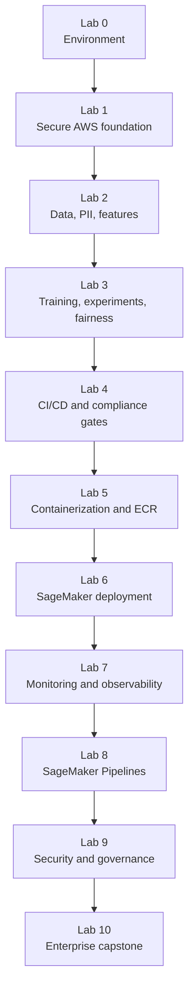

# AI-MLOps on AWS — Complete Lab Guide

**Class:** `ai-mlops-2026-jun30`  
**Region:** `us-west-2`  
**Delivery model:** ProTech VM → AWS Console → EC2 → VS Code Remote SSH → bash  
**Repository:** [gjkaur/ai-infra-mlops](https://github.com/gjkaur/ai-infra-mlops) · [Innovation-In-Software/ai-infra-mlops](https://github.com/Innovation-In-Software/ai-infra-mlops)

This repository contains an end-to-end banking MLOps lab sequence on AWS. The labs start with environment setup, then build a secure AWS foundation, generate and protect banking data, train and validate models, package and deploy a model, monitor it in production, automate the workflow with SageMaker Pipelines, add governance controls, and finish with an enterprise architecture capstone.

The course is intentionally cumulative. Each lab creates artifacts that later labs reuse. By the end, you have a working reference implementation of a regulated, auditable, production-oriented MLOps workflow.

---

## How to Use This Repository

All participant work should be done on the EC2 lab machine, not on local Windows PowerShell.

```bash
cd ~/ai-infra-mlops
git pull
cd lab0    # then lab1, lab2, ..., lab10
```

Every lab has two main documents:

| File | Purpose |
|------|---------|
| `labN/STEPS.md` | The hands-on class guide. Follow this during the lab. It includes commands, expected outputs, and screenshot references. |
| `labN/README.md` | The conceptual lab guide. It explains the lab flow, scripts, architecture role, and produced artifacts. |

All generated outputs go under:

```text
~/ai-infra-mlops/workspace/labN/
```

The `workspace/` folder is ignored by git because it contains generated lab outputs, AWS resource metadata, reports, model artifacts, logs, and other participant-specific files.

---

## Course Architecture at a Glance

The labs map to the major layers of an enterprise MLOps platform:



The sequence is designed this way because production ML is not just model training. A real ML system needs secure infrastructure, trusted data, repeatable training, automated quality gates, versioned artifacts, controlled deployment, live monitoring, auditability, governance, and an enterprise operating model.

---

## Lab Index

| Lab | Topic | Main guide | Concept guide |
|:---:|-------|------------|---------------|
| 0 | Environment setup | [lab0/STEPS.md](lab0/STEPS.md) | [lab0/README.md](lab0/README.md) |
| 1 | Secure MLOps environment | [lab1/STEPS.md](lab1/STEPS.md) | [lab1/README.md](lab1/README.md) |
| 2 | Banking data and PII protection | [lab2/STEPS.md](lab2/STEPS.md) | [lab2/README.md](lab2/README.md) |
| 3 | Model training and fairness testing | [lab3/STEPS.md](lab3/STEPS.md) | [lab3/README.md](lab3/README.md) |
| 4 | CI/CD pipeline with compliance gates | [lab4/STEPS.md](lab4/STEPS.md) | [lab4/README.md](lab4/README.md) |
| 5 | Secure containerization | [lab5/STEPS.md](lab5/STEPS.md) | [lab5/README.md](lab5/README.md) |
| 6 | Blue-green model deployment | [lab6/STEPS.md](lab6/STEPS.md) | [lab6/README.md](lab6/README.md) |
| 7 | Monitoring and observability | [lab7/STEPS.md](lab7/STEPS.md) | [lab7/README.md](lab7/README.md) |
| 8 | End-to-end SageMaker Pipeline | [lab8/STEPS.md](lab8/STEPS.md) | [lab8/README.md](lab8/README.md) |
| 9 | Security and governance framework | [lab9/STEPS.md](lab9/STEPS.md) | [lab9/README.md](lab9/README.md) |
| 10 | Enterprise architecture capstone | [lab10/STEPS.md](lab10/STEPS.md) | [lab10/README.md](lab10/README.md) |

Optional extensions:

| Optional lab | Topic | Guide |
|--------------|-------|-------|
| Lab 3b | Managed SageMaker training job | [optional/lab3b/STEPS.md](optional/lab3b/STEPS.md) |
| Lab 4b | Real AWS CodeBuild and CodePipeline | [optional/lab4b/STEPS.md](optional/lab4b/STEPS.md) |

---

## Important Runtime Assumptions

The labs assume:

- Commands run on Amazon Linux EC2 through VS Code Remote SSH.
- AWS region is `us-west-2`.
- AWS credentials are configured on the EC2 instance with `aws configure`, unless an instructor-provided instance profile is used.
- Python 3.11, pip, Git, AWS CLI, and Docker are available.
- Lab 1 is completed before labs that need S3, IAM, KMS, SageMaker, and CloudTrail.
- Lab 2 is completed before labs that need engineered data and preprocessing artifacts.
- Lab 3 is completed before labs that need trained models and fairness results.
- Lab 5 is completed before labs that need an ECR image.
- Lab 6 is completed before labs that monitor or govern a deployed endpoint.

Classroom defaults:

```bash
export LAB_NUM_RECORDS=1000
export LAB_USE_COMPREHEND=0
```

`LAB_USE_COMPREHEND=0` keeps the PII lab fast by using pattern-based detection instead of a slower Amazon Comprehend path.

---

## Lab 0 — Environment Setup and Prerequisites

**Goal:** Prepare the EC2 lab machine and repository workspace used by every later lab.

### What You Do

You start in the ProTech lab portal, connect to a Windows training VM, sign in to the AWS Console, create or confirm an EC2 lab instance, connect to that instance from VS Code using Remote SSH, install required tools, clone this repository, configure AWS access, install Python dependencies, configure Docker, scaffold workspace folders, and run automated verification.

### Why This Lab Exists

The rest of the course depends on a consistent execution environment. MLOps work touches AWS APIs, Python packages, Docker, SageMaker, S3, IAM, and local files. If each participant runs commands from a different machine or shell, errors become hard to diagnose. Lab 0 standardizes the runtime so later labs focus on MLOps concepts rather than environment drift.

### How It Works

The lab separates responsibilities:

- The ProTech VM provides a controlled desktop and browser environment.
- The AWS Console is used to create the EC2 lab host.
- VS Code Remote SSH gives a developer-friendly editor and terminal connected to EC2.
- The repository is cloned onto EC2, where all lab commands run.
- `setup_lab_directories.py` creates `workspace/lab1` through `workspace/lab10`.
- `verify_environment.py` checks Python, packages, AWS CLI, credentials, region, repo clone, workspace folders, and Docker.

### Key Scripts

| Script | What it does |
|--------|--------------|
| `lab0/scripts/setup_lab_directories.py` | Creates the workspace folder structure used by all labs. |
| `lab0/scripts/test_imports.py` | Confirms required Python packages import successfully. |
| `lab0/scripts/run_lab0_setup.py` | Runs the workspace setup flow. |
| `lab0/scripts/verify_environment.py` | Performs the final environment readiness checks. |
| `lab0/scripts/setup_classroom_env.sh` | Sets common classroom environment variables. |

### Outputs

| Output | Purpose |
|--------|---------|
| `workspace/lab1` through `workspace/lab10` | Per-lab generated output folders. |
| `lab0/logs/verification_results.json` | Environment verification record. |
| `workspace/logs/lab0-setup.log` | Setup log. |

### Success Gate

`verify_environment.py` reports **9/9 checks passed**. After that, the environment is ready for AWS resource creation in Lab 1.

---

## Lab 1 — Secure MLOps Environment Setup

**Goal:** Build the secure AWS foundation for the banking MLOps platform.

### What You Do

You create customer-managed KMS keys, encrypted S3 buckets, banking IAM roles, a SageMaker Studio domain, and CloudTrail audit logging. The lab also validates that the foundation is compliant and records configuration files for downstream labs.

### Why This Lab Exists

Regulated ML systems need security and auditability from the beginning. Data, models, logs, and governance evidence must be encrypted, access-controlled, and traceable. Lab 1 creates the foundation that later labs depend on instead of treating security as an afterthought.

### How It Works

The lab provisions resources in a dependency-aware order:

1. KMS keys are created first because S3 and SageMaker resources need encryption.
2. S3 buckets are created with KMS encryption, public access blocking, and versioning where needed.
3. IAM roles are created for banking personas with scoped permissions.
4. SageMaker Studio is created using the secure configuration.
5. CloudTrail is enabled to capture API activity for audit evidence.
6. A validation script checks the expected resources and configuration files.

### Key AWS Resources

| Resource | Purpose |
|----------|---------|
| KMS key for S3 | Encrypt banking data, model artifacts, reports, logs, and audit records. |
| KMS key for SageMaker | Encrypt SageMaker resources and later ML workloads. |
| S3 buckets | Separate storage for raw data, processed data, models, monitoring, governance, and audit evidence. |
| IAM roles | Represent data scientist, ML engineer, and compliance officer responsibilities. |
| SageMaker Studio domain | Managed ML development workspace. |
| CloudTrail | Audit trail for AWS API calls. |

### Key Scripts

| Script | What it does |
|--------|--------------|
| `create_kms_keys.py` | Creates customer-managed KMS keys and saves their ARNs. |
| `create_banking_buckets.py` | Creates encrypted S3 buckets for lab data and artifacts. |
| `create_banking_iam_roles.py` | Creates banking IAM roles and policies. |
| `create_sagemaker_studio.py` | Creates the SageMaker Studio domain. |
| `enable_audit_logging.py` | Enables CloudTrail and audit storage. |
| `validate_environment.py` | Runs compliance checks against the environment. |
| `run_lab1.py` | Runs the main Lab 1 setup scripts in order. |

### Outputs

| Output | Purpose |
|--------|---------|
| `workspace/lab1/config/kms_keys.json` | KMS key metadata. |
| `workspace/lab1/config/buckets.json` | Bucket names and ARNs used by later labs. |
| `workspace/lab1/config/iam_roles.json` | IAM role ARNs used by SageMaker, pipelines, and governance scripts. |
| `workspace/lab1/config/sagemaker_studio.json` | SageMaker Studio domain metadata. |
| `workspace/lab1/config/region_restriction_policy.json` | Example guardrail policy pattern. |
| `workspace/lab1/results/compliance_report.json` | Security foundation validation report. |

### Success Gate

`validate_environment.py` reports **13/13 COMPLIANT**. Later labs read Lab 1 config files to find buckets, roles, keys, and audit settings.

---

## Lab 2 — Banking Data Management and PII Protection

**Goal:** Create a banking data pipeline that protects personally identifiable information and produces reusable ML features.

### What You Do

You generate synthetic banking data, detect PII, anonymize sensitive columns, run data quality validation, engineer ML features, set up SageMaker Feature Store metadata, and create a drift baseline.

### Why This Lab Exists

In production ML, data quality and data protection are often more important than the model algorithm. Banking data can contain names, account details, emails, phone numbers, dates of birth, and other regulated fields. Before training, the system needs repeatable controls for privacy, validation, feature generation, feature reuse, and drift detection.

### How It Works

The lab follows a data governance flow:

1. Generate or download a synthetic banking dataset.
2. Detect PII using pattern rules or Amazon Comprehend, depending on configuration.
3. Anonymize PII so downstream ML scripts avoid exposing sensitive values.
4. Validate data quality, including schema and missing-value checks.
5. Engineer model-ready features from raw banking fields.
6. Save a preprocessing object for reuse during training and inference.
7. Register or configure feature store artifacts.
8. Produce a baseline used later for drift monitoring.

### Key Scripts

| Script | What it does |
|--------|--------------|
| `download_banking_data.py` | Creates or fetches the banking dataset used in the course. |
| `pii_detection_anonymization.py` | Detects and masks sensitive personal information. |
| `data_validation.py` | Checks data quality and schema expectations. |
| `feature_engineering.py` | Builds model-ready features and preprocessing artifacts. |
| `feature_store_setup.py` | Prepares SageMaker Feature Store configuration. |
| `data_drift_detection.py` | Creates baseline statistics for later monitoring. |
| `generate_compliance_doc.py` | Produces data compliance evidence. |
| `validate_lab2.py` | Confirms required Lab 2 artifacts exist. |
| `run_lab2.py` | Runs the main Lab 2 workflow. |

### Outputs

| Output | Purpose |
|--------|---------|
| `workspace/lab2/data/` | Raw, anonymized, validated, and engineered datasets. |
| `workspace/lab2/data/engineered_banking_data.csv` | Main feature dataset used by training and pipelines. |
| `workspace/lab2/models/preprocessor.pkl` | Preprocessing object reused by model training and inference packaging. |
| `workspace/lab2/config/feature_store_config.json` | Feature Store configuration evidence. |
| `workspace/lab2/results/` | Data validation, drift, and compliance reports. |

### Success Gate

`validate_lab2.py` passes. The most important downstream artifacts are `engineered_banking_data.csv`, `preprocessor.pkl`, and `feature_store_config.json`.

---

## Lab 3 — Model Training and Fairness Testing

**Goal:** Train candidate banking models, compare them, test fairness, and select the best model artifact.

### What You Do

You load the engineered data from Lab 2, train several ML models, log experiment metadata, compare model metrics, run fairness testing across an age-group attribute, and select a best model for later packaging and deployment.

### Why This Lab Exists

Model development needs more than a high accuracy score. A production banking model must be reproducible, comparable, and fair enough to pass governance review. Lab 3 introduces experiment tracking, model comparison, fairness metrics, and model selection as first-class MLOps activities.

### How It Works

The lab runs a structured training workflow:

1. Load engineered features from Lab 2.
2. Split data into train/test sets.
3. Train Logistic Regression, Random Forest, and XGBoost models.
4. Record metrics and metadata as experiment evidence.
5. Evaluate fairness using disparate impact on `age_group`.
6. Select the best-performing compliant model.
7. Save the selected model and test data for later labs.

The optional Lab 3b extension moves part of this workflow into managed SageMaker training infrastructure.

### Key Scripts

| Script | What it does |
|--------|--------------|
| `load_training_data.py` | Loads Lab 2 engineered data and prepares train/test inputs. |
| `train_models.py` | Trains candidate models and writes model artifacts. |
| `sagemaker_experiments.py` | Records experiment metadata and comparison information. |
| `fairness_testing.py` | Calculates fairness metrics such as disparate impact. |
| `select_best_model.py` | Chooses and saves the best model artifact. |
| `validate_lab3.py` | Confirms the training and fairness outputs exist. |
| `run_lab3.py` | Runs the Lab 3 workflow. |

### Outputs

| Output | Purpose |
|--------|---------|
| `workspace/lab3/models/best_model.pkl` | Selected model used by Lab 5 containerization and Lab 9 explainability. |
| `workspace/lab3/data/X_test.csv` | Holdout features used for testing, monitoring, and explainability. |
| `workspace/lab3/results/training_results.json` | Training metrics and model comparison evidence. |
| `workspace/lab3/results/fairness_report.json` | Fairness evaluation evidence. |
| `workspace/lab3/config/` | Experiment and model selection metadata. |

### Success Gate

`validate_lab3.py` passes and `best_model.pkl` exists. Lab 4 uses the model and validation logic, Lab 5 packages the model, and Lab 9 uses it for governance and explainability.

---

## Optional Lab 3b — Managed SageMaker Training

**Goal:** Show how the local training pattern can be moved to managed SageMaker infrastructure.

### What You Do

You upload training data to S3, patch or confirm IAM permissions for SageMaker, run a managed training or processing job, and validate the managed-job output.

### Why This Exists

Local training is useful for learning and small experiments, but enterprise training usually runs on managed infrastructure for scalability, repeatability, isolation, and auditability. Optional Lab 3b introduces that transition without replacing the core Lab 3 flow.

### Main Location

```text
optional/lab3b/
workspace/optional-lab3b/
```

---

## Lab 4 — CI/CD Pipeline with Compliance Gates

**Goal:** Add automated quality, security, and compliance checks around the ML project.

### What You Do

You scaffold a CI/CD project structure, create testable components, run unit tests, run compliance checks for PII, fairness, and security, simulate a pipeline execution, and generate a compliance report.

### Why This Lab Exists

Traditional CI/CD checks whether software builds and tests pass. ML CI/CD must also check data quality, model behavior, fairness, security, and compliance evidence. Lab 4 demonstrates how regulated ML teams can prevent unsafe artifacts from moving forward.

### How It Works

The lab creates a pipeline-like local project:

1. Set up build, test, source, and report folders.
2. Install test dependencies.
3. Run unit tests with `pytest`.
4. Run compliance checks that represent approval gates.
5. Simulate a pipeline execution.
6. Produce a report summarizing pass/fail gate status.

The optional Lab 4b extension deploys real AWS CodeBuild and CodePipeline resources.

### Key Scripts

| Script | What it does |
|--------|--------------|
| `setup_project_structure.py` | Creates CI/CD project folders and starter files. |
| `run_compliance_checks.py` | Runs PII, fairness, and security compliance gates. |
| `setup_codepipeline.py` | Prepares CodePipeline-oriented configuration. |
| `simulate_pipeline_run.py` | Simulates an automated pipeline run. |
| `generate_cicd_report.py` | Writes the CI/CD compliance report. |
| `validate_lab4.py` | Validates required Lab 4 outputs. |
| `run_lab4.py` | Runs the main Lab 4 workflow. |

### Outputs

| Output | Purpose |
|--------|---------|
| `workspace/lab4/` | CI/CD project and generated artifacts. |
| `workspace/lab4/results/cicd_compliance_report.json` | Compliance gate report. |
| `workspace/lab4/config/` | Pipeline and compliance configuration. |
| `lab4/tests/` | Unit and compliance tests used by the lab. |

### Success Gate

`validate_lab4.py` passes. The model workflow now has a quality-control layer before packaging and deployment.

---

## Optional Lab 4b — Real CodeBuild and CodePipeline

**Goal:** Deploy the CI/CD pattern into real AWS developer tools.

### What You Do

You package pipeline source, create or patch IAM permissions, create a CodeBuild project, create a CodePipeline pipeline, start the pipeline, and validate AWS-side execution.

### Why This Exists

Lab 4 teaches the pipeline logic locally. Optional Lab 4b shows how that logic maps to managed AWS build and release services. It is useful for instructors or classes that want the full cloud CI/CD experience.

### Main Location

```text
optional/lab4b/
workspace/optional-lab4b/
```

---

## Lab 5 — Secure Containerization for Banking

**Goal:** Package the trained model into a secure inference container and publish it to Amazon ECR.

### What You Do

You prepare the selected model and preprocessing artifacts, build a Docker image named for banking inference, run local container tests, create an ECR repository, push the image to ECR, run or record a vulnerability scan, and generate a container compliance report.

### Why This Lab Exists

Deployment requires a consistent runtime. A model that works on one machine may fail in production if package versions, file paths, server behavior, or system dependencies differ. Containers package the model, code, dependencies, and serving interface together. ECR provides a controlled registry for versioned images.

### How It Works

The lab uses:

- `Dockerfile` to define the inference image.
- `src/serve.py` to expose inference behavior.
- Local Docker commands to build and test `/ping` and `/invocations`.
- ECR to store the production image.
- Scan and report scripts to produce compliance evidence.

### Key Scripts

| Script | What it does |
|--------|--------------|
| `prepare_artifacts.py` | Copies model and preprocessing artifacts into the container build context. |
| `build_container.sh` | Builds the Docker image. |
| `test_container.py` | Tests local container health and inference endpoints. |
| `create_ecr_repo.py` | Creates the ECR repository. |
| `push_to_ecr.py` / `push_to_ecr.sh` | Tags and pushes the image to ECR. |
| `scan_container.py` | Checks or records container image scan status. |
| `generate_container_report.py` | Creates container compliance evidence. |
| `validate_lab5.py` | Confirms image, ECR, and report artifacts exist. |
| `run_lab5.py` | Runs the Lab 5 workflow. |

### Outputs

| Output | Purpose |
|--------|---------|
| `workspace/lab5/config/ecr_config.json` | ECR image URI and repository metadata. |
| `workspace/lab5/config/container_scan.json` | Container scan evidence. |
| `workspace/lab5/results/container_compliance_report.json` | Container security/compliance report. |
| Docker image `banking-ml-inference` | Local deployable inference image. |
| ECR repository `banking-ml-inference` | AWS-hosted container registry for later deployment. |

### Success Gate

`validate_lab5.py` passes. Lab 6 uses the ECR image to create SageMaker endpoints, and Lab 8 references it for model registration.

---

## Lab 6 — Model Deployment with Blue-Green Strategy

**Goal:** Deploy the containerized model to SageMaker endpoints using a controlled blue-green deployment pattern.

### What You Do

You prepare deployment metadata, configure a blue-green deployment plan, deploy a staging endpoint, test staging inference, deploy a production endpoint, shift traffic between variants, run a rollback drill, and generate a deployment report.

### Why This Lab Exists

ML deployment should not be a one-shot push to production. Banking systems need controlled rollout, validation before promotion, rollback plans, and audit records. Blue-green deployment reduces risk by keeping an existing stable version while gradually introducing a new version.

### How It Works

The lab connects the Lab 5 ECR image to SageMaker hosting:

1. Resolve image URI, IAM role, and model artifact locations.
2. Define blue and green production variants.
3. Create a staging endpoint and test it.
4. Create a production endpoint.
5. Shift production traffic gradually.
6. Roll back traffic as a drill.
7. Save evidence for compliance and Lab 10 architecture scoring.

### Key Scripts

| Script | What it does |
|--------|--------------|
| `prepare_deployment.py` | Resolves deployment inputs from earlier labs. |
| `configure_blue_green.py` | Creates the variant and traffic-shift plan. |
| `deploy_staging.py` | Deploys the staging SageMaker endpoint. |
| `test_deployment.py` | Invokes the endpoint and checks inference behavior. |
| `deploy_production.py` | Deploys production endpoint variants. |
| `shift_traffic.py` | Adjusts endpoint variant weights. |
| `rollback.py` | Restores traffic to the stable variant. |
| `generate_deployment_report.py` | Creates deployment compliance evidence. |
| `validate_lab6.py` | Confirms deployment outputs exist. |
| `run_lab6.py` | Runs the Lab 6 workflow. |

### Outputs

| Output | Purpose |
|--------|---------|
| `workspace/lab6/config/deployment_state.json` | Resolved image, role, and deployment metadata. |
| `workspace/lab6/config/blue_green_plan.json` | Blue-green rollout plan. |
| `workspace/lab6/config/staging_deployment.json` | Staging endpoint metadata. |
| `workspace/lab6/config/production_deployment.json` | Production endpoint metadata. |
| `workspace/lab6/config/traffic_shift.json` | Traffic-shift record. |
| `workspace/lab6/config/rollback_log.json` | Rollback drill evidence. |
| `workspace/lab6/config/deployment_report.json` | Deployment compliance report. |

### Success Gate

`validate_lab6.py` passes and the production endpoint is available. Lab 7 monitors this endpoint.

---

## Lab 7 — Compliance Monitoring and Observability

**Goal:** Add monitoring, dashboards, alarms, drift checks, model-quality checks, and incident-response evidence for the deployed model.

### What You Do

You prepare baseline and current datasets, configure a CloudWatch dashboard, configure Model Monitor metadata, run data drift checks, query model-quality metrics, create CloudWatch alarms, simulate an incident response, and generate a monitoring compliance report.

### Why This Lab Exists

Models degrade after deployment. Input populations shift, traffic changes, latency spikes, dependencies fail, and prediction quality can drift. Production MLOps needs monitoring that covers both operational health and ML-specific behavior. Lab 7 makes the deployed endpoint observable and auditable.

### How It Works

The lab links Lab 2 data and Lab 6 deployment:

1. Use historical data as a baseline.
2. Create current sample data for drift comparison.
3. Create CloudWatch dashboard widgets for endpoint metrics.
4. Record Model Monitor configuration.
5. Compare current data to baseline distributions.
6. Query SageMaker endpoint latency and error metrics.
7. Configure alarms for operational issues.
8. Simulate an incident and document the response.

### Key Scripts

| Script | What it does |
|--------|--------------|
| `prepare_monitoring_data.py` | Creates baseline and current data files for monitoring. |
| `setup_cloudwatch_dashboard.py` | Creates the CloudWatch dashboard. |
| `setup_model_monitor.py` | Records Model Monitor baseline and endpoint association. |
| `monitor_data_drift.py` | Runs statistical drift checks. |
| `monitor_model_quality.py` | Reads CloudWatch metrics for latency and errors. |
| `setup_alarms.py` | Creates CloudWatch alarms. |
| `simulate_incident.py` | Runs a tabletop incident simulation. |
| `generate_monitoring_report.py` | Produces the monitoring compliance report. |
| `validate_lab7.py` | Validates monitoring artifacts. |
| `run_lab7.py` | Runs the Lab 7 workflow. |

### Outputs

| Output | Purpose |
|--------|---------|
| `workspace/lab7/data/baseline_data.csv` | Baseline data for drift checks. |
| `workspace/lab7/data/current_data.csv` | Current data sample for drift checks. |
| `workspace/lab7/config/dashboard_config.json` | CloudWatch dashboard metadata. |
| `workspace/lab7/config/model_monitor.json` | Model Monitor setup metadata. |
| `workspace/lab7/config/drift_monitor_report.json` | Drift analysis output. |
| `workspace/lab7/config/quality_report.json` | Latency and error summary. |
| `workspace/lab7/config/alarms.json` | Alarm definitions and ARNs. |
| `workspace/lab7/logs/incident_drill.json` | Incident-response evidence. |
| `workspace/lab7/results/monitoring_report_final.json` | Final monitoring compliance report. |

### Success Gate

`validate_lab7.py` passes. Lab 8 then automates the workflow with SageMaker Pipelines.

---

## Lab 8 — End-to-End SageMaker Pipeline

**Goal:** Automate the ML workflow with a real SageMaker Pipeline and register the model in the SageMaker Model Registry.

### What You Do

You refresh IAM permissions, define pipeline parameters, upload input data to S3, build a pipeline definition, upsert the pipeline to SageMaker, start a pipeline execution, monitor step status, register a model package, generate a pipeline compliance report, and validate the result.

### Why This Lab Exists

Manual ML workflows are hard to repeat and audit. SageMaker Pipelines turns the workflow into a versioned, executable graph. This improves reproducibility, provides execution history, supports automated gates, and connects model development to registry-driven deployment governance.

### How It Works

The lab creates a pipeline named `banking-ml-pipeline`:

1. Refresh `BankingMLEngineerRole` permissions from Lab 1.
2. Copy Lab 2 engineered data to S3.
3. Define pipeline parameters such as input data path and processing settings.
4. Build a SageMaker ProcessingStep for data validation.
5. Upsert the pipeline into SageMaker.
6. Start and monitor execution.
7. Register the model in the `banking-risk-models` model package group.
8. Write compliance evidence.

### Pipeline Entry Point

| File | Purpose |
|------|---------|
| `lab8/pipeline/validate_data.py` | SageMaker ProcessingStep script that validates pipeline input data. |
| `lab8/pipeline/pipeline_definition.json` | Local pipeline definition stub/record. |

### Key Scripts

| Script | What it does |
|--------|--------------|
| `define_pipeline_params.py` | Defines parameters and copies input data to S3. |
| `build_pipeline.py` | Builds local pipeline graph metadata. |
| `upsert_pipeline.py` | Creates or updates the SageMaker Pipeline. |
| `start_pipeline.py` | Starts execution and waits for completion. |
| `monitor_pipeline.py` | Reads execution and step status. |
| `register_model.py` | Registers the model package in SageMaker Model Registry. |
| `generate_pipeline_report.py` | Creates pipeline compliance evidence. |
| `validate_lab8.py` | Confirms pipeline, execution, monitor, and registry artifacts. |
| `run_lab8.py` | Runs the Lab 8 workflow, including IAM refresh. |

### Outputs

| Output | Purpose |
|--------|---------|
| `workspace/lab8/config/pipeline_params.json` | Pipeline parameter values. |
| `workspace/lab8/config/pipeline_definition.json` | Pipeline graph evidence. |
| `workspace/lab8/config/pipeline_registration.json` | SageMaker pipeline ARN and registration metadata. |
| `workspace/lab8/config/pipeline_execution.json` | Execution ARN and status. |
| `workspace/lab8/config/pipeline_monitor.json` | Per-step execution status. |
| `workspace/lab8/config/model_registry.json` | Model package ARN and registry metadata. |
| `workspace/lab8/results/pipeline_compliance_report_final.json` | Pipeline compliance report. |

### Success Gate

`validate_lab8.py` passes. Lab 9 uses the model registry and pipeline evidence for governance.

---

## Lab 9 — Banking Security and Governance Framework

**Goal:** Implement governance controls for IAM, encryption, model approval, explainability, fairness, and audit trails.

### What You Do

You load governance context from prior labs, review IAM policies, audit encryption, simulate model approval, generate SHAP explainability, run fairness governance checks, export CloudTrail audit events, generate a governance report, and validate the lab.

### Why This Lab Exists

In regulated environments, a model cannot be considered production-ready just because it deploys successfully. The organization must prove that access is controlled, data and artifacts are encrypted, model behavior is explainable, fairness thresholds are evaluated, approvals are traceable, and audit evidence exists.

### How It Works

The lab aggregates evidence from the system:

1. Link Lab 1 IAM and CloudTrail context.
2. Link Lab 8 model registry context.
3. Review the banking IAM roles for least privilege.
4. Check encryption across S3, SageMaker, ECR, and KMS usage.
5. Create a model approval workflow state.
6. Use SHAP to explain the selected model.
7. Recompute fairness checks against governance thresholds.
8. Export recent CloudTrail events.
9. Aggregate all evidence into a governance report.

### Key Scripts

| Script | What it does |
|--------|--------------|
| `load_governance_baseline.py` | Links IAM, registry, CloudTrail, model, and test-data context. |
| `review_iam_policies.py` | Reviews banking IAM roles and policies. |
| `audit_encryption.py` | Checks encryption posture across AWS resources. |
| `model_approval_workflow.py` | Records approval state for the model. |
| `generate_explainability.py` | Produces SHAP-based feature importance. |
| `governance_fairness_check.py` | Evaluates fairness against governance threshold. |
| `export_audit_trail.py` | Exports CloudTrail event samples. |
| `generate_governance_report.py` | Aggregates governance evidence. |
| `validate_lab9.py` | Confirms required governance outputs exist. |
| `run_lab9.py` | Runs the Lab 9 workflow. |

### Outputs

| Output | Purpose |
|--------|---------|
| `workspace/lab9/config/governance_state.json` | Links to prior lab evidence. |
| `workspace/lab9/config/iam_review.json` | IAM least-privilege review. |
| `workspace/lab9/config/encryption_audit.json` | Encryption compliance evidence. |
| `workspace/lab9/config/approval_workflow.json` | Model approval workflow state. |
| `workspace/lab9/results/explainability_report.json` | SHAP explainability output. |
| `workspace/lab9/results/governance_fairness.json` | Fairness governance result. |
| `workspace/lab9/logs/governance_audit_export.json` | CloudTrail audit sample. |
| `workspace/lab9/results/governance_report_final.json` | Final governance compliance report. |

### Success Gate

`validate_lab9.py` passes. Lab 10 then uses governance evidence as one of the enterprise architecture layers.

---

## Lab 10 — Enterprise MLOps Architecture Capstone

**Goal:** Assemble all previous lab outputs into an enterprise architecture assessment, gap analysis, roadmap, checklist, executive summary, and compliance bundle.

### What You Do

You collect artifacts from Labs 1 through 9, assess the architecture across seven layers, identify remaining gaps, create an implementation roadmap, create an implementation checklist, generate an executive summary, build a compliance bundle zip file, and validate course completion. Optional teardown scripts can remove generated resources after the course.

### Why This Lab Exists

Enterprise MLOps is about the whole operating model, not a single script. Leaders and auditors need a concise view of what exists, what gaps remain, how mature the architecture is, and what should happen next. Lab 10 converts the hands-on technical work into stakeholder-facing evidence.

### How It Works

The lab scores seven architecture layers:

| Layer | Evidence source |
|-------|-----------------|
| Security | Lab 1 buckets and IAM roles |
| Data | Lab 2 Feature Store configuration |
| Training | Lab 3 training results |
| Deployment | Lab 6 staging and production deployment files |
| Monitoring | Lab 7 dashboard and alarms |
| Pipeline | Lab 8 pipeline and model registry files |
| Governance | Lab 9 IAM and encryption reports |

The assessment script checks for required marker files, computes an architecture score, and writes results. Follow-on scripts produce gap analysis, roadmap, checklist, executive summary, and a zipped compliance bundle.

### Key Scripts

| Script | What it does |
|--------|--------------|
| `collect_course_artifacts.py` | Inventories prior lab artifacts and live AWS resources. |
| `architecture_assessment.py` | Scores the architecture across seven layers. |
| `gap_analysis.py` | Identifies missing or future enterprise capabilities. |
| `implementation_roadmap.py` | Produces a phased roadmap. |
| `implementation_checklist.py` | Creates an implementation checklist. |
| `generate_executive_summary.py` | Writes a leadership summary. |
| `build_compliance_bundle.py` | Creates a zip archive of key deliverables. |
| `validate_lab10.py` | Validates final capstone completion. |
| `run_lab10.py` | Runs the main Lab 10 workflow. |

### Outputs

| Output | Purpose |
|--------|---------|
| `workspace/lab10/config/artifact_manifest.json` | Inventory of course artifacts. |
| `workspace/lab10/results/architecture_assessment.json` | Layer score and architecture status. |
| `workspace/lab10/results/gap_analysis.json` | Remaining enterprise gaps. |
| `workspace/lab10/results/implementation_roadmap.json` | Phased implementation roadmap. |
| `workspace/lab10/results/implementation_checklist.json` | Completion and future-work checklist. |
| `workspace/lab10/results/executive_summary.md` | Executive-level summary. |
| `workspace/lab10/results/course_compliance_bundle.zip` | Final compliance bundle for audit/stakeholder review. |

### Success Gate

`validate_lab10.py` passes and prints course completion. The architecture score should be at least 90, and a compliance bundle must exist.

---

## How the Labs Depend on Each Other

| Later lab | Depends on | Why |
|-----------|------------|-----|
| Lab 1 | Lab 0 | Needs verified EC2 tooling and AWS credentials. |
| Lab 2 | Lab 1 | Needs encrypted S3, IAM roles, and KMS. |
| Lab 3 | Lab 2 | Needs engineered data and preprocessing artifacts. |
| Lab 4 | Labs 2–3 | Needs data/model validation logic for compliance gates. |
| Lab 5 | Lab 3 | Needs `best_model.pkl`; also uses Lab 2 preprocessor. |
| Lab 6 | Lab 5 | Needs ECR image for SageMaker endpoint deployment. |
| Lab 7 | Lab 6 | Needs a production endpoint to monitor. |
| Lab 8 | Labs 1, 2, 5 | Needs IAM, S3 data, and model/container registry context. |
| Lab 9 | Labs 1, 3, 5, 8 | Needs IAM, model, container, registry, and audit context. |
| Lab 10 | Labs 1–9 | Needs all evidence for the enterprise capstone. |

---

## Quick Validation Commands

Run these from the EC2 repo root as you progress:

```bash
cd ~/ai-infra-mlops/lab0  && python3 scripts/verify_environment.py
cd ~/ai-infra-mlops/lab1  && python3 scripts/validate_environment.py
cd ~/ai-infra-mlops/lab2  && python3 scripts/validate_lab2.py
cd ~/ai-infra-mlops/lab3  && python3 scripts/validate_lab3.py
cd ~/ai-infra-mlops/lab4  && python3 scripts/validate_lab4.py
cd ~/ai-infra-mlops/lab5  && python3 scripts/validate_lab5.py
cd ~/ai-infra-mlops/lab6  && python3 scripts/validate_lab6.py
cd ~/ai-infra-mlops/lab7  && python3 scripts/validate_lab7.py
cd ~/ai-infra-mlops/lab8  && python3 scripts/validate_lab8.py
cd ~/ai-infra-mlops/lab9  && python3 scripts/validate_lab9.py
cd ~/ai-infra-mlops/lab10 && python3 scripts/validate_lab10.py
```

---

## Quick Run Commands

Most labs also include an orchestrator script:

```bash
cd ~/ai-infra-mlops/lab1  && python3 scripts/run_lab1.py
cd ~/ai-infra-mlops/lab2  && python3 scripts/run_lab2.py
cd ~/ai-infra-mlops/lab3  && python3 scripts/run_lab3.py
cd ~/ai-infra-mlops/lab4  && python3 scripts/run_lab4.py
cd ~/ai-infra-mlops/lab5  && python3 scripts/run_lab5.py
cd ~/ai-infra-mlops/lab6  && python3 scripts/run_lab6.py
cd ~/ai-infra-mlops/lab7  && python3 scripts/run_lab7.py
cd ~/ai-infra-mlops/lab8  && python3 scripts/run_lab8.py
cd ~/ai-infra-mlops/lab9  && python3 scripts/run_lab9.py
cd ~/ai-infra-mlops/lab10 && python3 scripts/run_lab10.py
```

Use `STEPS.md` during class because it explains each command and expected result. Use quick-run scripts when rerunning a lab or validating an instructor environment.

---

## Reset and Teardown

To clear generated workspace files for selected labs:

```bash
cd ~/ai-infra-mlops
python3 scripts/reset_course.py --labs lab1,lab2,lab3,lab4,lab5,lab6,lab7,lab8,lab9,lab10
```

To remove AWS resources after the course:

```bash
cd ~/ai-infra-mlops
python3 scripts/teardown_course.py --yes
```

Optional EC2 termination:

```bash
python3 scripts/teardown_course.py --yes --terminate-ec2
```

Be careful with teardown. It is intended for the end of the course or instructor reset workflows.

---

## Troubleshooting Principles

| Symptom | First thing to check |
|---------|----------------------|
| AWS command fails | Run `aws sts get-caller-identity` and confirm region `us-west-2`. |
| A lab says prior artifacts are missing | Run the previous lab validation script. |
| SageMaker pipeline permissions fail | Re-run `lab1/scripts/create_banking_iam_roles.py`. |
| Docker permission denied | Confirm Docker is installed and reconnect after group membership changes. |
| Feature Store already exists | Use `lab2/scripts/cleanup_lab2.py --aws` before rerunning Feature Store setup. |
| SageMaker endpoint is slow to create | Wait; endpoint creation can take several minutes. |
| CloudWatch metrics are empty | Invoke the endpoint first, then wait for metrics to appear. |

---

## Supporting Documentation

| Document | Purpose |
|----------|---------|
| [CANONICAL-REPO.md](CANONICAL-REPO.md) | Authoritative GitHub repository and clone instructions. |
| [CLOUD-DELIVERY.md](CLOUD-DELIVERY.md) | Instructor cloud delivery model and class timing. |
| [docs/READING-THE-LABS.md](docs/READING-THE-LABS.md) | How to read and follow `STEPS.md`. |
| [docs/REAL-VS-SIMULATED.md](docs/REAL-VS-SIMULATED.md) | Which labs create live AWS resources vs. local simulations. |
| [docs/SSH-VSCODE-SETUP.md](docs/SSH-VSCODE-SETUP.md) | VS Code Remote SSH setup. |
| [docs/PROTECH-VM-SETUP.md](docs/PROTECH-VM-SETUP.md) | Instructor ProTech VM and EC2 setup. |
| [docs/EC2-TESTING.md](docs/EC2-TESTING.md) | EC2 testing notes. |
| [optional/README.md](optional/README.md) | Optional Lab 3b and Lab 4b locations. |

---

## Final Outcome

After completing Labs 0–10, you will have built a complete AWS banking MLOps reference path:

- Secure AWS foundation with KMS, S3, IAM, SageMaker, and CloudTrail.
- Privacy-aware data pipeline with PII protection and feature engineering.
- Reproducible model training with experiment evidence and fairness checks.
- CI/CD-style validation with ML compliance gates.
- Containerized inference image stored in ECR.
- SageMaker staging and production endpoints with blue-green deployment.
- Monitoring, drift checks, dashboards, alarms, and incident evidence.
- SageMaker Pipeline and Model Registry integration.
- Governance reports for IAM, encryption, approval, explainability, fairness, and auditability.
- Enterprise architecture assessment, roadmap, checklist, executive summary, and compliance bundle.

The finished course demonstrates how MLOps turns a model into a governed production system.
