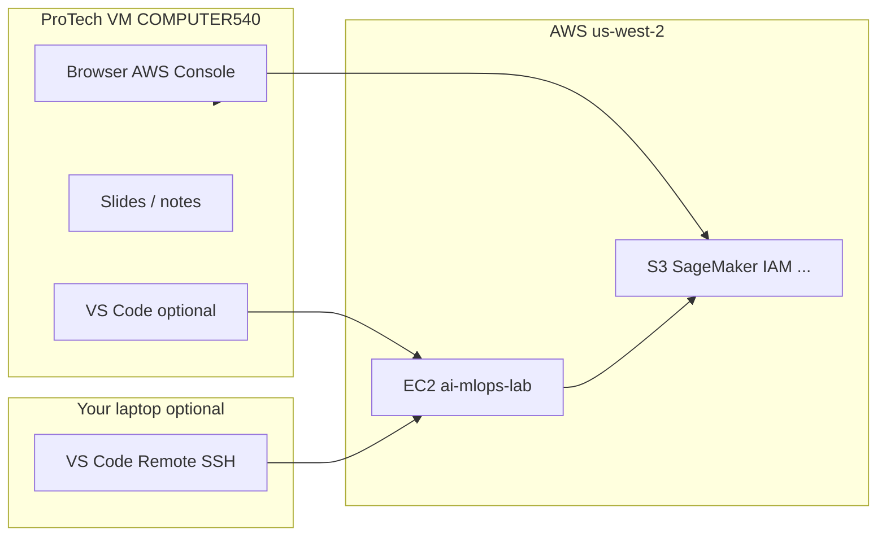

# Instructor setup: ProTech VM + AWS EC2 (dual delivery)

Use **both** environments during class:

| Machine | Role |
|---------|------|
| **ProTech VM** (`COMPUTER540`) | Slides, AWS Console in browser, VS Code UI, student Q&A |
| **AWS EC2** (`ai-mlops-lab`) | All lab commands from `labN/STEPS.md` (bash, Docker, SageMaker SDK) |

Lab steps are written for **Linux bash on EC2**. The ProTech host is **Windows** — do not run lab scripts in PowerShell on the VM unless you use WSL (optional backup below).

**Portal:** [labs.protechtraining.com](https://labs.protechtraining.com)

---

## Architecture



---

## 1. ProTech portal (fill in from your handout)

Store credentials in your password manager or ProTech handout — **never in git**.

| Field | Your value |
|-------|------------|
| Portal URL | https://labs.protechtraining.com |
| Portal user ID | `PTACCESS___` |
| Portal password | *(from handout)* |
| Host computer | `COMPUTER___` |
| VM username | `Administrator` |
| VM password | *(from handout)* |
| Role | INSTRUCTOR |

**Connect:** sign in at the portal → launch/connect to your host → RDP or in-browser session as `Administrator`.

**Participant steps:** [lab0/STEPS.md](../lab0/STEPS.md) **Steps 1–3** (portal → VM desktop) before AWS or EC2 work.

---

## 2. ProTech VM — before class

### Install (once per VM)

| Tool | Purpose |
|------|---------|
| [VS Code](https://code.visualstudio.com/) | Remote SSH to EC2; preview `STEPS.md` |
| **Remote - SSH** extension | Connect to `ai-mlops-lab` |
| [AWS CLI for Windows](https://aws.amazon.com/cli/) (optional) | Quick `aws sts get-caller-identity` from VM |
| [Git for Windows](https://git-scm.com/) (optional) | Clone repo for reading guides offline |

### On the VM desktop

1. **Browser** — bookmark AWS console sign-in (instructor account, `us-west-2`).
2. **VS Code** — add SSH host (section 4).
3. **Slides / course materials** — open from ProTech desktop or USB; VM is your “front of room” display.
4. **Do not** paste AWS access keys into documents, screenshots, or chat.

### Optional: WSL on ProTech (backup only)

If EC2 is unreachable, you can run labs in Ubuntu on the same VM. This is slower to set up than EC2 and is **not** the primary path.

```powershell
# PowerShell as Administrator — one-time
wsl --install -d Ubuntu
```

After reboot, in **Ubuntu**:

```bash
sudo apt update && sudo apt install -y git python3 python3-pip docker.io
sudo usermod -aG docker $USER   # log out/in
git clone https://github.com/gjkaur/ai-infra-mlops.git ~/ai-infra-mlops
cd ~/ai-infra-mlops/lab0 && pip3 install -r requirements.txt
aws configure   # region us-west-2; keys from handout only
```

Use **VS Code → WSL: Ubuntu** and the same `labN/STEPS.md` commands as on EC2.

---

## 3. AWS EC2 — lab execution host

Full instance notes: [EC2-TESTING.md](EC2-TESTING.md).

| Item | Typical value |
|------|----------------|
| Instance | `ai-mlops-lab` |
| User | `ec2-user` |
| Region | `us-west-2` |
| Repo on instance | `~/ai-infra-mlops` |
| Root volume | **30 GB+** |

**Start instance** before class if stopped. Refresh **public IP** after start.

**AWS on EC2** (matches student steps):

```bash
aws configure set region us-west-2
aws configure set output json
# Set access key + secret from instructor handout (not in git):
aws configure set aws_access_key_id YOUR_KEY
aws configure set aws_secret_access_key YOUR_SECRET
aws sts get-caller-identity
```

---

## 4. SSH config (on ProTech VM or laptop)

Edit SSH config:

- **Windows:** `C:\Users\Administrator\.ssh\config` (ProTech VM) or your user profile on laptop
- **Linux/macOS:** `~/.ssh/config`

```
Host ai-mlops-lab
    HostName YOUR_EC2_PUBLIC_IP
    User ec2-user
    IdentityFile C:/Users/Administrator/.ssh/ai-mlops-instructor.pem
```

Copy the `.pem` key to the machine where VS Code runs (ProTech VM or laptop). **Never commit** the `.pem` file.

**VS Code:** `Ctrl+Shift+P` → **Remote-SSH: Connect to Host** → `ai-mlops-lab` → open `/home/ec2-user/ai-infra-mlops`.

Details: [SSH-VSCODE-SETUP.md](SSH-VSCODE-SETUP.md).

---

## 5. Typical class flow (both machines)

| When | ProTech VM | EC2 (VS Code terminal) |
|------|------------|-------------------------|
| Intro / theory | Slides on VM display | — |
| “Open Lab N guide” | Show `labN/STEPS.md` preview in VS Code | Same file on EC2 |
| Live demo | Watch terminal on projector via VS Code | Run **Do this** commands |
| AWS Console tour | Browser on VM | — |
| Lab time | Roam; help students with SSH | Students on their own EC2 |
| Teardown | — | [Lab 10 Step 11](../lab10/STEPS.md): `teardown_course.py --yes` |

**Rule:** Commands in **Expected result** blocks were captured on EC2 bash — run them there, not in Windows PowerShell.

---

## 6. Pre-class checklist

### ProTech VM

- [ ] Portal login works; RDP to host computer
- [ ] VS Code + Remote SSH installed
- [ ] `.pem` on VM (or SSH from laptop instead)
- [ ] AWS console login works in browser (`us-west-2`)
- [ ] Slides and timing notes ready

### EC2

- [ ] Instance **running**; security group allows SSH from your IP (or ProTech egress IP)
- [ ] `git pull` in `~/ai-infra-mlops`
- [ ] `aws sts get-caller-identity` shows instructor account
- [ ] Lab 0 verify passes: `cd lab0 && python3 scripts/verify_environment.py`
- [ ] Docker works (Lab 5): `docker ps`

### Repo

- [ ] Latest `STEPS.md` (no `--dry-run` in participant steps)
- [ ] [CLOUD-DELIVERY.md](../CLOUD-DELIVERY.md) timing reviewed

---

## 7. Troubleshooting

| Issue | Where to fix |
|-------|----------------|
| Cannot RDP to ProTech host | Portal support; confirm host name and session |
| SSH timeout to EC2 | Start instance; update IP in SSH config; open port 22 |
| VS Code “Permission denied (publickey)” | PEM path and `chmod 400` equivalent on key file |
| `aws` fails on EC2 | Re-run `aws configure`; check region `us-west-2` |
| Lab works on EC2 but not on VM PowerShell | Expected — use EC2 bash or WSL Ubuntu |
| Disk full on EC2 | Expand volume to 30 GB+; `pip install` needs space |

---

## 8. Security

- Portal, VM, and AWS passwords/keys: **handout or password manager only**
- Do not commit `.pem`, `.aws/`, `.env`, or keys to [ai-infra-mlops](https://github.com/gjkaur/ai-infra-mlops)
- Pre-push check: `bash scripts/check_no_secrets.sh`

---

## Related docs

- [CLOUD-DELIVERY.md](../CLOUD-DELIVERY.md) — class timing and AMI
- [EC2-TESTING.md](EC2-TESTING.md) — instructor EC2 details
- [SSH-VSCODE-SETUP.md](SSH-VSCODE-SETUP.md) — student SSH workflow
- [READING-THE-LABS.md](READING-THE-LABS.md) — how to read STEPS.md
