# Lab 0: Environment Setup & Prerequisites

**Class:** `ai-mlops-2026-jun30` · **Region:** `us-west-2` · **Duration:** ~50–65 min

Hands-on steps: [STEPS.md](STEPS.md)

---

## Terms & acronyms (beginners)

| Term | Full form / meaning |
|------|---------------------|
| **AWS** | **Amazon Web Services** — cloud platform where you run labs 1–10 |
| **EC2** | **Elastic Compute Cloud** — a virtual server (your lab machine) in AWS |
| **RDP** | **Remote Desktop Protocol** — connect to the training VM with a graphical desktop |
| **SSH** | **Secure Shell** — encrypted way to open a terminal on a remote machine (EC2) |
| **CLI** | **Command Line Interface** — run commands in a terminal (`aws`, `python3`, `git`) |
| **VS Code** | **Visual Studio Code** — code editor; **Remote SSH** connects it to EC2 |
| **API** | **Application Programming Interface** — how programs talk to AWS services |
| **Docker** | Platform to package apps and models into **containers** (used in Lab 5) |
| **MLOps** | **Machine Learning Operations** — practices to build, deploy, and monitor ML systems |
| **JSON** | **JavaScript Object Notation** — text format for config files (`.json`) |

---

## Overview

Lab 0 prepares the **EC2 lab machine** and the **student workspace** used by Labs 1–10. You sign in through the training portal, connect to EC2 with VS Code Remote SSH, install tools, clone this repository, and verify that Python, AWS CLI, Docker, and the workspace layout are ready.

Nothing in Lab 0 creates banking AWS resources. It only validates your environment and scaffolds local directories under `~/ai-infra-mlops/workspace/`.

---

## Prerequisites

- Training portal access and EC2 instance (see STEPS.md Steps 1–13)
- AWS access keys configured on EC2 (`aws configure`, region `us-west-2`)

---

## Lab flowchart

```mermaid
flowchart TB
    subgraph P1["Phase 1: Portal and VM"]
        direction TB
        S1["Sign in<br/>ProTech portal"] --> S2["RDP to<br/>training VM"]
        S2 --> S3["Open browser<br/>on VM"]
    end

    subgraph P2["Phase 2: AWS Console"]
        direction TB
        A1["AWS sign-in"] --> A2["Region<br/>us-west-2"]
        A2 --> A3["Create<br/>key pair"]
        A3 --> A4["Security group<br/>allow SSH"]
        A4 --> A5["Launch EC2<br/>t3.large"]
        A5 --> A6["Copy<br/>public IP"]
    end

    subgraph P3["Phase 3: VS Code SSH"]
        direction TB
        V1["Install VS Code<br/>Remote SSH"] --> V2["Connect<br/>to EC2"]
        V2 --> V3["Open folder<br/>ai-infra-mlops"]
    end

    subgraph P4["Phase 4: EC2 tools"]
        direction TB
        T1["git clone"] --> T2["aws configure"]
        T2 --> T3["Python 3.11<br/>pip install"]
        T3 --> T4["test_imports.py"]
        T4 --> T5["Install Docker"]
        T5 --> T6["setup_classroom_env.sh"]
        T6 --> T7["setup_lab_directories.py"]
    end

    subgraph P5["Phase 5: Verify"]
        direction TB
        R1["run_lab0_setup.py"] --> R2["verify_environment.py"]
        R2 --> R3{"9 of 9<br/>checks pass?"}
        R3 -->|Yes| OK(["Proceed<br/>to Lab 1"])
        R3 -->|No| FIX["Fix issue<br/>re-run verify"]
        FIX --> R2
    end

    P1 --> P2 --> P3 --> P4 --> P5

    style OK fill:#2d6a4f,color:#fff
    style R3 fill:#e9c46a,color:#000
```

## Lab flow

| Phase | What happens |
|-------|----------------|
| **Infrastructure** | EC2 `t3.large`, security group, key pair, public IP |
| **Tooling** | `git`, `python3`, `aws` CLI v2, Docker |
| **Workspace** | `workspace/lab1`–`lab10`, `shared_data`, `logs`, etc. |
| **Verification** | Nine automated checks must all pass |

**Success gate:** `verify_environment.py` reports **9/9 passed** → proceed to [Lab 1](../lab1/STEPS.md).

---

## Scripts reference

All scripts live in `lab0/scripts/`.

### `verify_environment.py`

Runs nine environment checks:

1. Python version (3.8+)
2. Required Python packages (`boto3`, `pandas`, etc.)
3. AWS CLI installed
4. AWS credentials and caller identity
5. Region set to `us-west-2`
6. Repository clone present
7. Workspace directory exists
8. Lab folders scaffolded
9. Docker available (for Lab 5+)

Writes results to `lab0/logs/verification_results.json`.

### `setup_lab_directories.py`

Creates the student workspace tree under `~/ai-infra-mlops/workspace/`:

- Per-lab folders: `lab1` … `lab10`, each with `config/`, `data/`, `results/`, `logs/`, `scripts/`
- Shared folders: `shared_data`, `config`, `results`, `logs`
- `workspace/config/labs_mapping.json` and `setup_info.txt`

### `test_imports.py`

Quick smoke test that core Python packages import without error. Run after `pip install -r requirements.txt`.

### `run_lab0_setup.py`

Orchestrator: runs `setup_lab_directories.py` then prints next steps. Use after workspace creation.

### `setup_classroom_env.sh`

Shell script that exports classroom defaults:

- `AWS_DEFAULT_REGION=us-west-2`
- `LAB_NUM_RECORDS=1000` (synthetic data size for Lab 2+)
- `LAB_USE_COMPREHEND=0` (skip Comprehend API in PII lab)

Source it with: `source scripts/setup_classroom_env.sh`

---

## Configuration

| File | Purpose |
|------|---------|
| `config/environment_config.json` | Course lab list, workspace directory names, Python minimum version |
| `config/screenshot_map.json` | Instructor screenshot mappings for STEPS.md images |
| `requirements.txt` | Python dependencies for Lab 0 and early labs |

---

## Outputs

| Location | Contents |
|----------|----------|
| `~/ai-infra-mlops/workspace/` | Empty scaffold for Labs 1–10 |
| `lab0/logs/verification_results.json` | Pass/fail per check |
| `workspace/logs/lab0-setup.log` | Setup timestamp log |

---

## Next lab

[Lab 1: Secure MLOps Environment Setup](../lab1/README.md) — creates **KMS** (Key Management Service), **S3** (Simple Storage Service), **IAM** (Identity and Access Management), **SageMaker** Studio, and **CloudTrail** in AWS.
