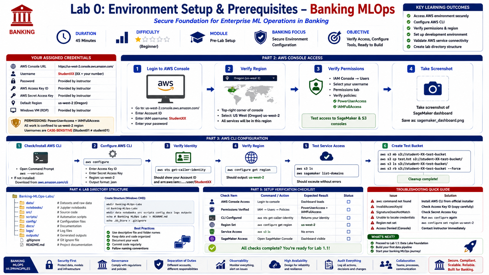
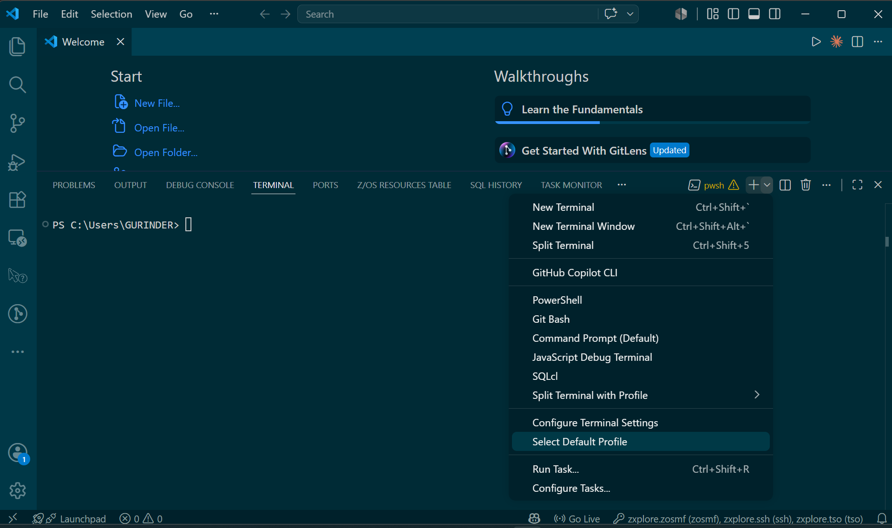
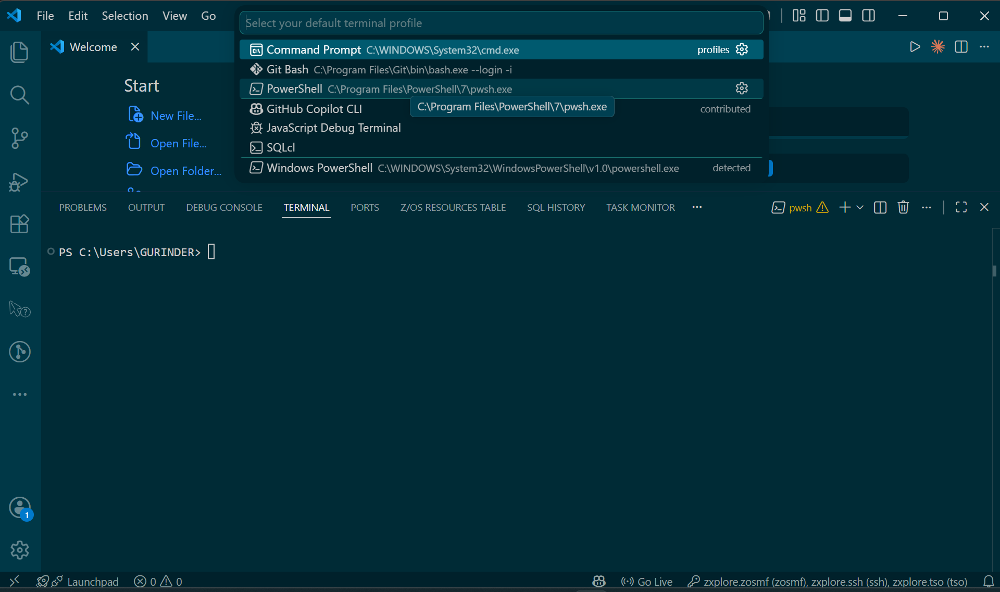
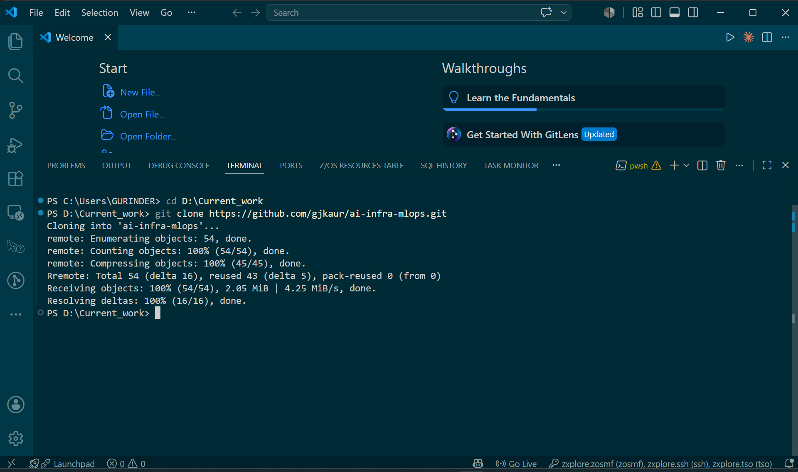
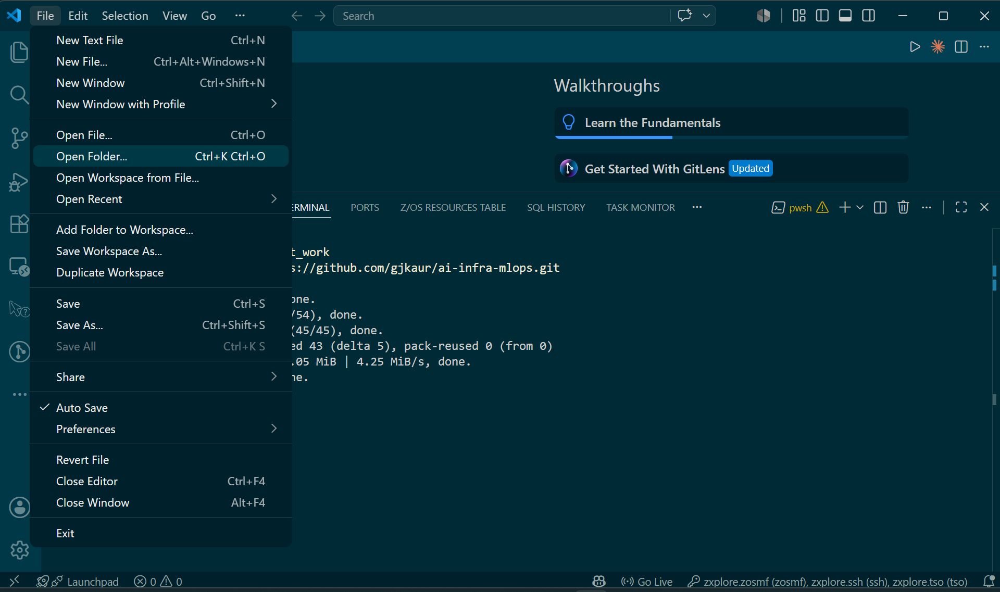
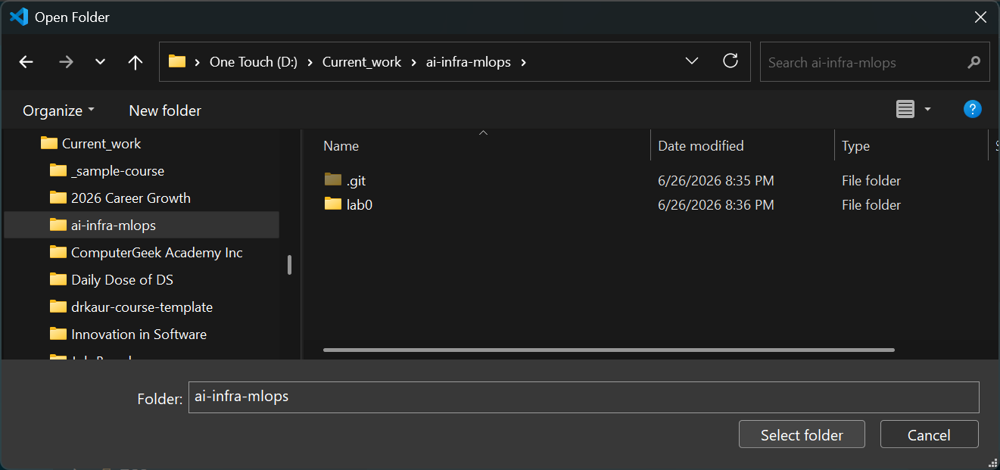
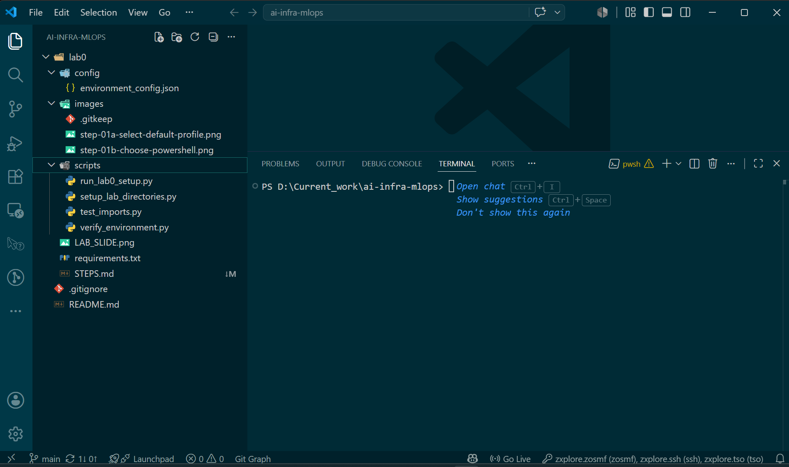

# Lab 0: Environment Setup & Prerequisites



| | |
|---|---|
| **Class** | ai-mlops-2026-jun30 |
| **Duration** | 30 minutes |
| **Region** | `us-west-2` |
| **Repo** | [github.com/gjkaur/ai-infra-mlops](https://github.com/gjkaur/ai-infra-mlops) |
| **Editor** | VS Code |
| **Terminal** | PowerShell (integrated terminal only) |

---

## How to use this guide

Do every step **in order**. All terminal commands run in **VS Code → PowerShell terminal** (bottom panel). AWS Console steps use your **browser**.

| Use | Do not use |
|-----|------------|
| VS Code integrated terminal | External terminal / CMD |
| **PowerShell** (`PS C:\...>`) | Command Prompt (`C:\...>`) |

---

## Credentials (from instructor)

| Item | Value |
|------|-------|
| Console URL | `https://iis-instructor-03.signin.aws.amazon.com/console` |
| Username | `StudentXX` (case-sensitive) |
| Password | From instructor |
| Access Key ID | From instructor |
| Secret Access Key | From instructor |
| Region | `us-west-2` |

---

## Step 1 — Open VS Code and set PowerShell as default terminal

**Do this:**

1. Open **VS Code** on your laptop.
2. Open the terminal panel at the bottom (**Terminal → New Terminal** or **Ctrl+Shift+`**).
3. In the **terminal toolbar** (top-right of the terminal panel), click the **˅** (down arrow) next to the **+** button.
4. Click **Select Default Profile**.



5. In **Select your default terminal profile**, click **PowerShell**  
   (path: `C:\Program Files\PowerShell\7\pwsh.exe` — **not** Command Prompt or Windows PowerShell).



6. **Terminal → New Terminal** (or click **+** in the terminal panel).
7. Confirm the prompt shows **`PS C:\...>`** and the profile label shows **pwsh**.

**Expected result:** Default terminal is PowerShell. New terminals open with a `PS` prompt.

| Correct | Wrong |
|---------|-------|
| **PowerShell** (`pwsh.exe`) | Command Prompt |
| Prompt: `PS C:\...>` | Prompt: `C:\...>` |

---

## Step 2 — Clone the participant repo

**Do this (VS Code terminal):**

```powershell
cd D:\Current_work
git clone https://github.com/gjkaur/ai-infra-mlops.git
```

If `D:\Current_work` does not exist, create it first:

```powershell
New-Item -ItemType Directory -Force -Path D:\Current_work
cd D:\Current_work
git clone https://github.com/gjkaur/ai-infra-mlops.git
```

**Expected result:** Folder `D:\Current_work\ai-infra-mlops` is created with `lab0`, `README.md`, etc.



---

## Step 3 — Open the repo in VS Code

**Do this:**

1. **File → Open Folder**



2. Navigate to **`D:\Current_work\ai-infra-mlops`**
3. Click **Select Folder**



4. In the **Explorer** (left panel), expand folders and confirm you see:
   - `README.md`
   - `lab0/`
   - `lab0/STEPS.md` ← this file
   - `lab0/LAB_SLIDE.png`
   - `lab0/scripts/`



**Expected result:** VS Code title bar shows `ai-infra-mlops`. Explorer shows the repo tree.

---

## Step 4 — View the lab slide and confirm lab folder

**Do this:**

1. In Explorer, click **`lab0/LAB_SLIDE.png`** to preview the lab overview.
2. Open a new terminal if needed: **Terminal → New Terminal**
3. Run:

```powershell
cd D:\Current_work\ai-infra-mlops\lab0
Get-ChildItem
```

**Expected result:** Terminal lists `scripts`, `config`, `requirements.txt`, `LAB_SLIDE.png`, `STEPS.md`, `images`.

**Screenshot:** `images/step-04-lab0-folder.png`

---

## Step 5 — Log in to AWS Console

**Do this (browser):**

1. Open **https://iis-instructor-03.signin.aws.amazon.com/console**
2. Enter your **username** (case-sensitive) and **password**
3. If prompted to set a new password, do so and save it securely
4. Set region to **US West (Oregon) `us-west-2`** (top-right corner)

Keep VS Code open — you will return to the terminal in Step 7.

**Expected result:** AWS Console home loads with no "Access Denied".

**Screenshots:**
- `images/step-05-aws-console-login.png`
- `images/step-06-aws-region-us-west-2.png`

---

## Step 6 — Verify console permissions

**Do this (browser):**

1. Search bar → type **IAM** → open **IAM** → **Users** → click your username
2. Confirm attached policies include **PowerUserAccess** and **IAMFullAccess**
3. Search **SageMaker** → dashboard loads
4. Search **S3** → bucket list loads

**Expected result:** All three consoles open without permission errors.

**Screenshots:**
- `images/step-07-iam-policies.png`
- `images/step-08-sagemaker-console.png`
- `images/step-09-s3-console.png`

---

## Step 7 — Install AWS CLI

**Do this (VS Code terminal):**

```powershell
aws --version
```

If you see `aws: The term 'aws' is not recognized`:

1. Download and install **AWS CLI v2** from https://aws.amazon.com/cli/
2. In VS Code: **Terminal → Kill Terminal**
3. **Terminal → New Terminal**
4. Run `aws --version` again

**Expected result:** Output like `aws-cli/2.x.x Python/3.x.x Windows/...`

**Screenshot:** `images/step-10-aws-cli-version.png`

---

## Step 8 — Configure AWS CLI

**Do this (VS Code terminal):**

```powershell
aws configure
```

Enter when prompted:

| Prompt | Enter |
|--------|-------|
| AWS Access Key ID | From instructor |
| AWS Secret Access Key | From instructor |
| Default region name | `us-west-2` |
| Default output format | `json` |

Verify:

```powershell
aws sts get-caller-identity
aws configure get region
aws s3 ls --region us-west-2
```

**Expected result:** JSON showing your IAM user ARN; region prints `us-west-2`; S3 command runs (empty list is OK).

**Screenshot:** `images/step-11-aws-sts-identity.png`

---

## Step 9 — Install Python packages

**Do this (VS Code terminal):**

```powershell
cd D:\Current_work\ai-infra-mlops\lab0
python --version
pip install -r requirements.txt
python scripts\test_imports.py
```

**Expected result:** Python 3.8 or higher; terminal prints `All imports successful!`

**Screenshot:** `images/step-12-python-imports.png`

---

## Step 10 — Create your personal workspace

**Do this (VS Code terminal):**

```powershell
python scripts\setup_lab_directories.py
Get-ChildItem $env:USERPROFILE\Documents\banking-mlops-labs
```

**Expected result:** Folders `lab0` through `lab10`, plus `config`, `shared_data`, `logs`, etc.

> This folder lives on your PC at `Documents\banking-mlops-labs` — it is **not** pushed to GitHub.

**Screenshot:** `images/step-13-workspace-folders.png`

---

## Step 11 — Run environment verification

**Do this (VS Code terminal):**

```powershell
python scripts\verify_environment.py --dry-run
python scripts\run_lab0_setup.py
python scripts\verify_environment.py
```

**Expected result:**

```
ALL CHECKS PASSED. Environment is ready.
   Proceed to Lab 1.1
```

**Screenshot:** `images/step-14-verification-pass.png`

---

## Step 12 — Completion checklist

| Task | Done |
|------|------|
| VS Code open on `ai-infra-mlops` | [ ] |
| Repo cloned from GitHub | [ ] |
| Terminal is PowerShell (`PS ...>`) | [ ] |
| Lab slide viewed (`LAB_SLIDE.png`) | [ ] |
| AWS Console login | [ ] |
| Region `us-west-2` | [ ] |
| AWS CLI installed and configured | [ ] |
| Python packages installed | [ ] |
| Workspace created | [ ] |
| Verification passed | [ ] |

---

## Troubleshooting

| Problem | Fix |
|---------|-----|
| Terminal shows `C:\...>` not `PS` | Terminal panel → **˅** next to **+** → **Select Default Profile** → **PowerShell** (see Step 1 screenshots) |
| `git` not found | Install Git from https://git-scm.com/ and restart VS Code |
| Clone fails | Check internet; confirm URL: `https://github.com/gjkaur/ai-infra-mlops.git` |
| `aws` not found after install | **Terminal → Kill Terminal** → **New Terminal** |
| Login fails | Username is case-sensitive (`Student01` ≠ `student01`) |
| Wrong region | Browser: US West (Oregon); terminal: `aws configure set region us-west-2` |
| Packages missing | `pip install -r requirements.txt` |
| Workspace missing | Re-run `python scripts\setup_lab_directories.py` |

---

**Lab 0 complete.** Lab 1.1 will be added as `lab1/` when published.

Save screenshots to **`lab0/images/`** using the filenames above.
