# Lab 0: Environment Setup & Prerequisites

| | |
|---|---|
| **Class** | `ai-mlops-2026-jun30` |
| **Duration** | ~50–65 minutes |
| **Region** | `us-west-2` (Oregon) |
| **Platform** | [ProTech VM](https://labs.protechtraining.com) → AWS Console → EC2 → [VS Code Remote SSH](../docs/SSH-VSCODE-SETUP.md) → **bash** |
| **Prerequisite** | None — start here |
| **Working directory (after SSH)** | `~/ai-infra-mlops/lab0` |
| **Outputs** | `~/ai-infra-mlops/workspace/lab0/` |
| **Repo** | [github.com/gjkaur/ai-infra-mlops](https://github.com/gjkaur/ai-infra-mlops) |

> **Steps 1–3:** Sign in at [labs.protechtraining.com](https://labs.protechtraining.com) and connect to your **training VM** first.  
> **Steps 4–6:** AWS Console sign-in and region (`us-west-2`) on the **ProTech VM browser**.  
> **Steps 7–10:** **Create your EC2 instance** in the AWS Console (key pair → security group → launch → copy public IP). **Required before VS Code.**  
> **Steps 11–13:** VS Code + Remote SSH on the **ProTech VM desktop** (connect to the EC2 you created).  
> **Steps 14–22:** All commands in the **VS Code integrated terminal** on EC2 (**bash**). Do not use Windows PowerShell for lab commands.

**Instructor dual setup:** [docs/PROTECH-VM-SETUP.md](../docs/PROTECH-VM-SETUP.md)

---

## Before you start

1. You need your **ProTech labs handout** (portal user ID, password, host computer name, VM login).
2. You also need **AWS** sign-in URL, IAM user, and password from the same handout.
3. **Always connect to the ProTech VM first** (Steps 1–3) — then use the VM’s browser and VS Code for everything else.
4. Keep AWS access keys in the handout only — **never paste keys into git, chat, or screenshots**.
5. **You must create (or confirm) an EC2 instance in Steps 7–10** before VS Code or any `bash` lab commands. There is no lab work on the ProTech VM alone.

---

## Lab 0 roadmap

| Steps | Where | What you do |
|------:|-------|-------------|
| **1–3** | ProTech portal + VM | Sign in, RDP to Windows training VM |
| **4–6** | VM browser → AWS | Sign in to AWS, set region **us-west-2**, open EC2 |
| **7–10** | VM browser → AWS EC2 | **Create EC2:** key pair → security group → launch instance → copy public IP |
| **11–13** | ProTech VM desktop | Install VS Code, SSH config, connect to **your EC2** |
| **14–22** | EC2 terminal (VS Code SSH) | Tools, clone repo, `aws configure`, Docker, workspace, verify 9/9 |

**Fresh start / after teardown:** Always run **Steps 7–10** to launch a new instance. Do not skip to VS Code without a running EC2.

---

## Step 1 — Open the ProTech labs portal (your laptop or browser)

**Do this:**

1. On your **physical laptop** (or any browser), open:
   ```
   https://labs.protechtraining.com
   ```
2. Bookmark the page — you use it at the **start of every class day** to reach your training VM.

**Expected result:** The ProTech Training labs sign-in page loads with fields for **User ID** and **Password**.

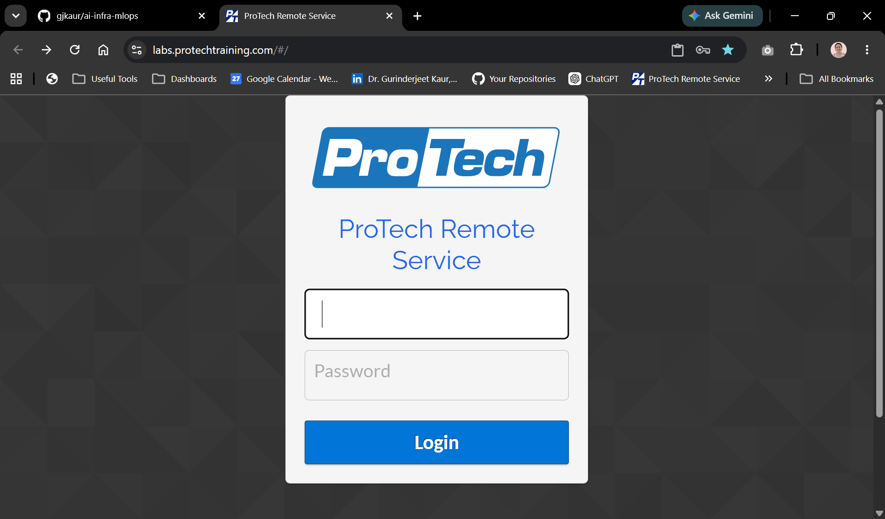

**Instructor example (copy-paste):**

```
https://labs.protechtraining.com
```

**Screenshot (optional):** `images/step-01-protech-portal.png`

---

## Step 2 — Sign in to the ProTech portal

**Do this:**

1. Enter **User ID** from your handout (example format: `PTACCESS###`).
2. Enter **Password** from your handout.
3. Click **Sign in** (or equivalent).

**Expected result:** You see a dashboard or list of **virtual machines / host computers** assigned to you.

**Instructor example (copy-paste):**

| Field | Value |
|-------|--------|
| User ID | `PTACCESS540` |
| Password | *(from instructor handout — do not commit)* |

**Screenshot (optional):** `images/step-02-protech-signin.png`

---

## Step 3 — Connect to your training VM (RDP)

**Do this:**

1. On the ProTech portal, find your **Host computer** name from the handout (example: `COMPUTER###`).
2. Click **Connect**, **Launch**, or **Start** for that host (wording varies on the portal).
3. When the remote session opens (RDP or in-browser desktop), sign in to Windows:
   - **Username:** `Administrator` (unless your handout says otherwise)
   - **Password:** VM password from your handout
4. Wait for the **Windows desktop** to load fully.
5. Open **Edge** or **Chrome** on the VM — you will use this browser for AWS Console steps.

**Expected result:** You are logged into a **Windows training VM**. The desktop shows the taskbar; you can open a browser and applications. **All remaining Lab 0 steps (except EC2 terminal work) run on this VM** until you connect VS Code to EC2 in Step 13.

**Instructor example (copy-paste):**

| Field | Value |
|-------|--------|
| Host computer | `COMPUTER540` |
| Windows username | `Administrator` |
| Windows password | *(from instructor handout — do not commit)* |

**Tip:** If RDP fails, confirm the host is **started** on the portal and try **Connect** again. Ask the instructor before using your personal laptop for AWS steps — the course expects the ProTech VM + EC2 workflow.

---

## Part 1 — Sign in to AWS (ProTech VM browser)

---

## Step 4 — Open the AWS sign-in page (browser)

**Do this:**

1. On your **ProTech VM desktop**, open **Edge** or **Chrome** (from Step 3).
2. In the address bar, paste the **AWS access portal URL** from your handout (example below).
3. Press **Enter**.
4. Bookmark the page for the rest of the course.

**Expected result:** The AWS IAM sign-in page loads.

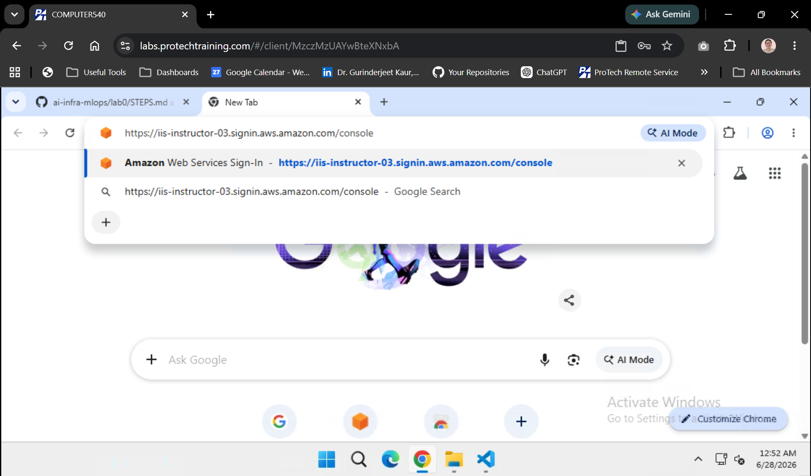

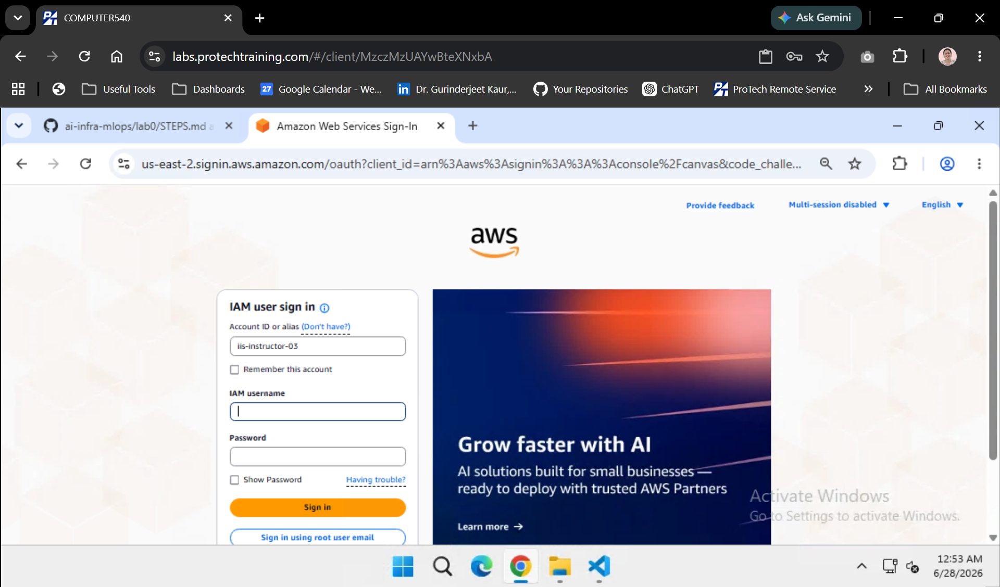

**Instructor example (copy-paste):**

```
https://iis-instructor-03.signin.aws.amazon.com/console
```

Paste that URL into the browser address bar and press Enter.

**Screenshot (optional):** `images/step-01-aws-signin-page.png`

---

## Step 5 — Sign in to your AWS account (browser)

**Do this:**

1. Enter **Account ID** or **account alias** from the handout.
2. Enter your **IAM user name** (example: `Instructor01` or your student user).
3. Enter your **password**.
4. Complete **MFA** if prompted.
5. Click **Sign in**.

**Expected result:** The **AWS Management Console** home page opens. The top navigation bar shows **Services**, **Search**, and your user name on the right.

**Instructor example (copy-paste):**

| Field | Value |
|-------|--------|
| Account ID | `028417007274` |
| IAM user name | `Instructor01` |
| Password | *(from instructor handout — do not commit)* |

After sign-in, top-right should show **`Instructor01`** and account **`028417007274`**.

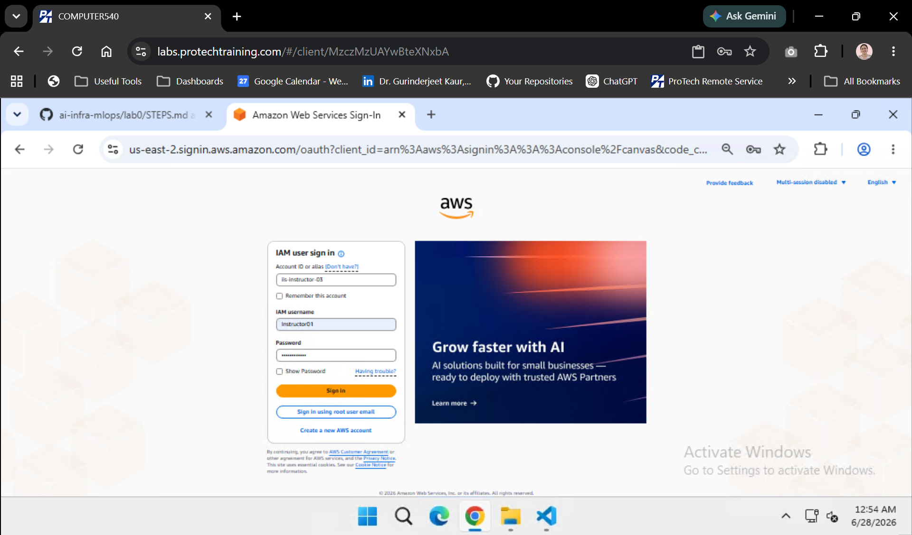

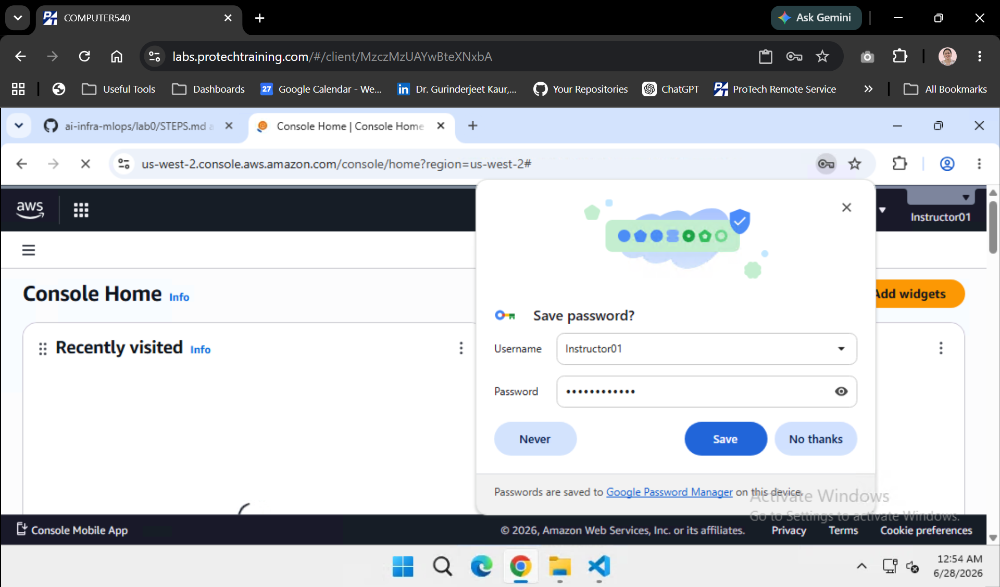

**Screenshot (optional):** `images/step-02-console-home.png`

---

## Step 6 — Open EC2 and set region to us-west-2 (browser)

**Do this:**

1. Look at the **region selector** in the top-right of the console (next to your user name).
2. Click the region name.
3. Select **United States (Oregon) `us-west-2`**.
4. Confirm the region label now shows **Oregon** or **us-west-2**.
5. In the console **Search** bar, type `EC2` and open **EC2**.
6. Confirm you are on the **EC2 Dashboard** (left menu shows **Instances**, **Key Pairs**, **Security Groups**, etc.).

**Expected result:** Region is **`us-west-2`** and the **EC2** console is open. You are ready to **create your lab EC2 instance** in Steps 7–10.

**Next:** Steps 7–10 — key pair, security group, launch `mlops-lab`, copy public IP. **Do not open VS Code until Step 11** (after the instance is **Running**).

**Tip:** Before each lab session, glance at the region selector — it sometimes resets after logout.

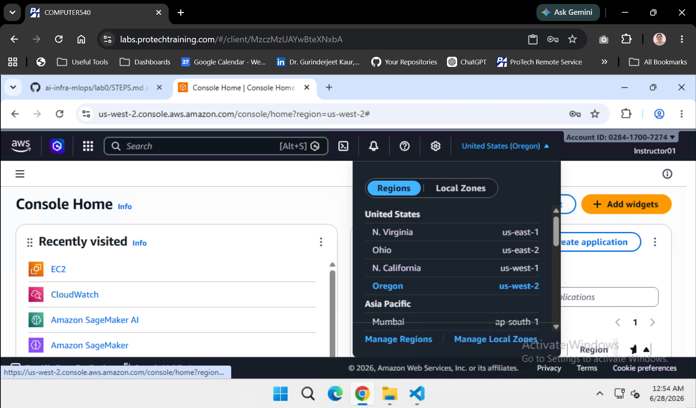

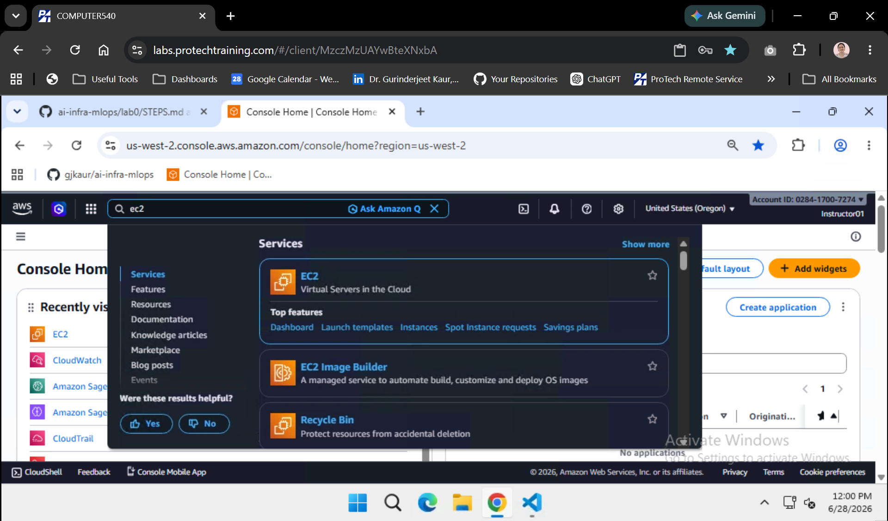

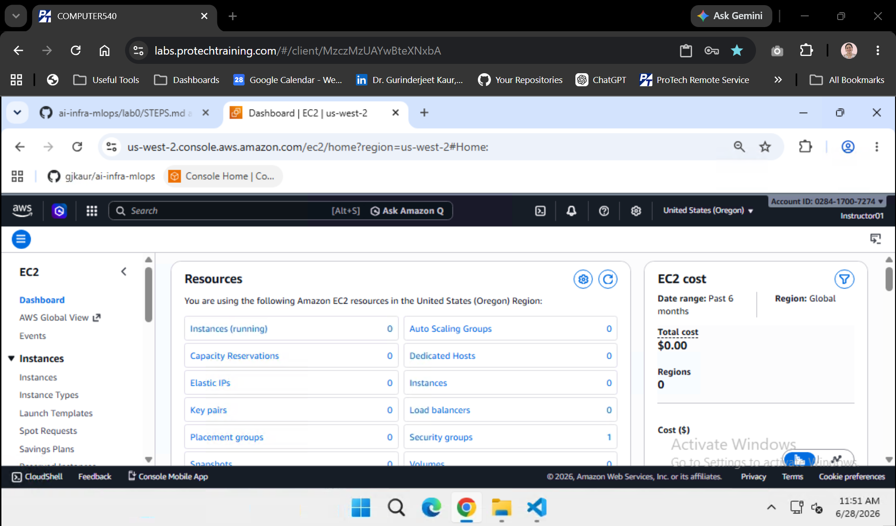

**Instructor example (copy-paste):**

1. Console search bar → type `EC2` → open **EC2**.
2. Region selector (top-right) → choose **United States (Oregon) us-west-2**.

Or open EC2 directly for this class:

```
https://us-west-2.console.aws.amazon.com/ec2/home?region=us-west-2
```

---

## Part 2 — Create your EC2 lab instance (AWS Console)

> **Required for everyone.** Complete **Steps 7–10** on the ProTech VM **browser** before VS Code (Step 11).  
> After [course teardown](../lab10/STEPS.md) or a new cohort, you must **launch a new instance** — the account will not have a shared lab VM unless your instructor pre-provisioned one.

---

## Step 7 — Create an EC2 key pair (browser)

**Do this:**

1. Confirm the region (top-right) is still **us-west-2** and you are in **EC2** (Step 6).
2. Left menu → **Network & Security** → **Key pairs**.
3. Click the orange **Create key pair** button.

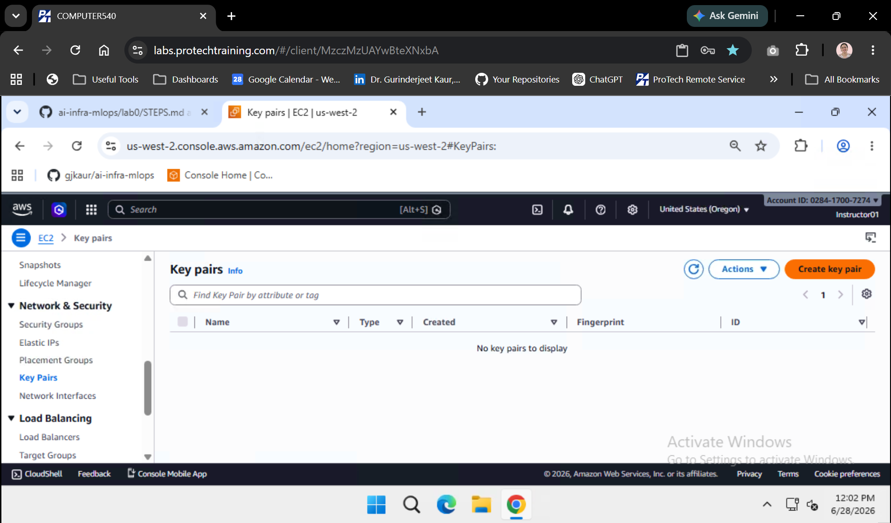

4. Fill in the form:

   | Setting | Value |
   |---------|--------|
   | **Key pair name** | `mlops-lab-key` (students) or `ai-mlops-instructor` (instructor) |
   | **Key pair type** | **RSA** |
   | **Private key file format** | **.pem** (for OpenSSH / VS Code) |

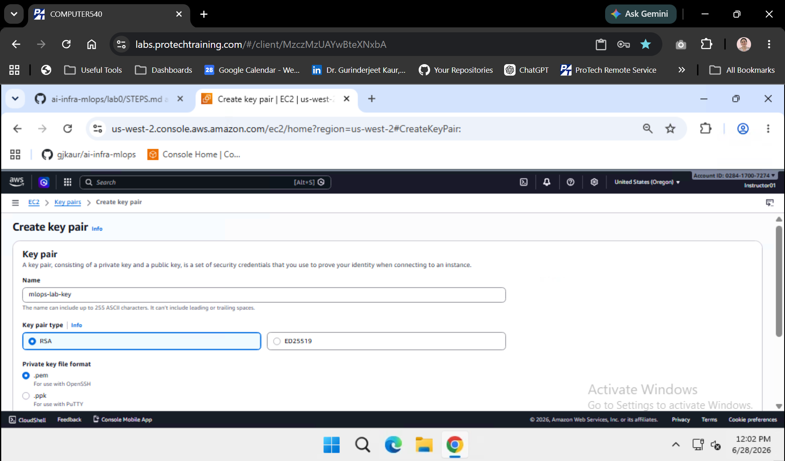

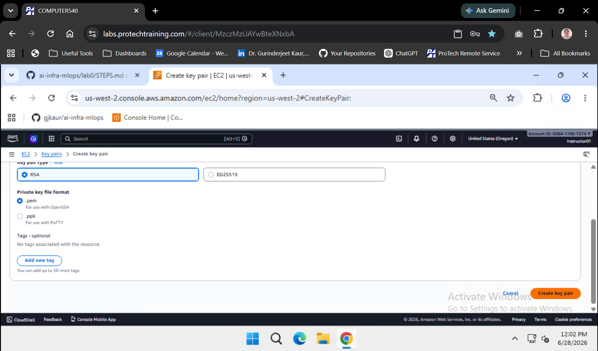

5. Click **Create key pair**.
6. The browser downloads a `.pem` file **once**. You cannot download it again.

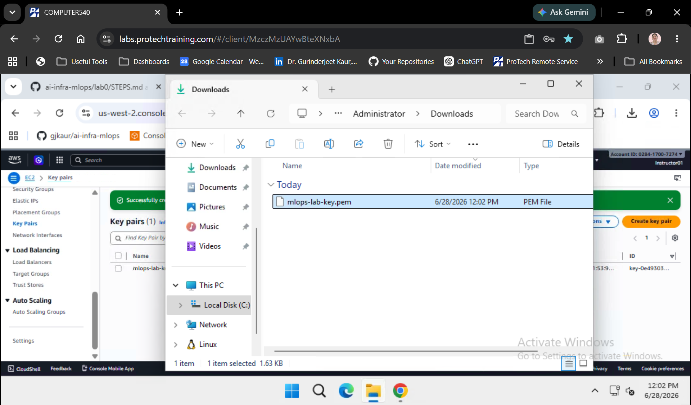

7. **Move the `.pem` to the Administrator SSH folder** (ProTech VM) — **not** `Downloads\.ssh`:

   The browser saves the key to **Downloads** first. Move it to:

   ```text
   C:\Users\Administrator\.ssh\mlops-lab-key.pem
   ```

   **Option A — File Explorer**

   | Step | Action |
   |------|--------|
   | 1 | Open **File Explorer** → **Downloads** — confirm `mlops-lab-key.pem` is there |

   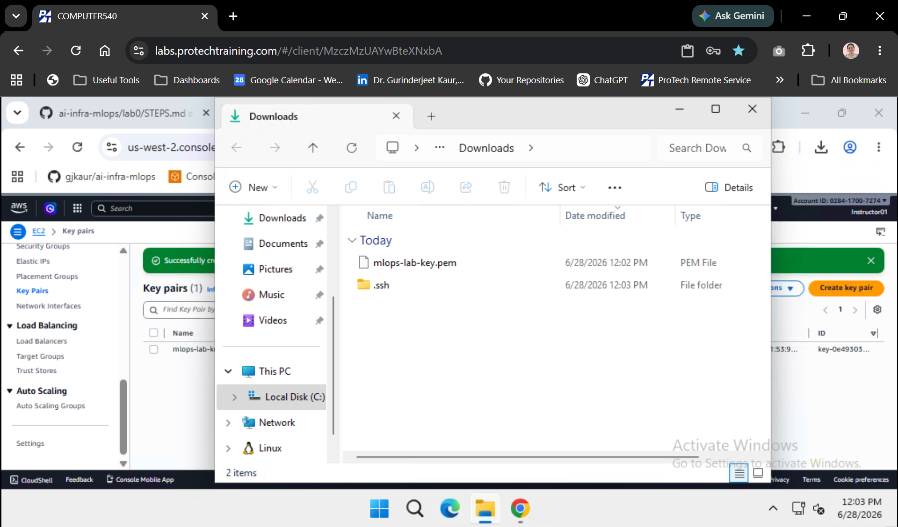

   | 2 | Click the address bar, paste `C:\Users\Administrator\.ssh`, press **Enter** |
   | 3 | If the folder does not exist, create it: **New folder** → name `.ssh` inside `C:\Users\Administrator` |
   | 4 | Open **Downloads** in a second window (or **Win+E** again) |
   | 5 | **Drag** `mlops-lab-key.pem` into `C:\Users\Administrator\.ssh` |

   **Option B — PowerShell (copy-paste on ProTech VM)**

   ```powershell
   New-Item -ItemType Directory -Force -Path C:\Users\Administrator\.ssh
   Move-Item -Force C:\Users\Administrator\Downloads\mlops-lab-key.pem C:\Users\Administrator\.ssh\
   Get-ChildItem C:\Users\Administrator\.ssh
   ```

   **Expected path in File Explorer address bar:**

   ```text
   C:\Users\Administrator\.ssh
   ```

   **Not** `C:\Users\Administrator\Downloads\.ssh` — VS Code SSH (Step 12) uses the profile `.ssh` folder above.

8. EC2 → **Key pairs** should list your key:

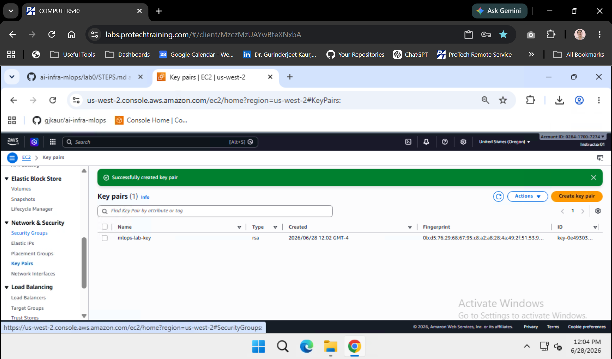

**Expected result:** Green banner **Successfully created key pair**; `mlops-lab-key.pem` saved under `C:\Users\Administrator\.ssh\`.

**Security:** Do not email the `.pem` file or commit it to git.

**Instructor example (copy-paste):**

| Setting | Instructor value |
|---------|------------------|
| Key pair name | `ai-mlops-instructor` |
| PEM on ProTech VM | `C:\Users\Administrator\.ssh\ai-mlops-instructor.pem` |

If `ai-mlops-instructor` already exists in EC2 → **Key Pairs**, you cannot re-download it — use the PEM from your secure folder. Students create their own key (e.g. `mlops-lab-key`).

---

## Step 8 — Create a security group for SSH (browser)

**Do this:**

1. EC2 left menu → **Network & Security** → **Security groups**.
2. **Before you create anything:** seeing **only 1** group named **`default`** is normal (every VPC has one; you cannot delete it). You will add **`mlops-lab-sg`** next.

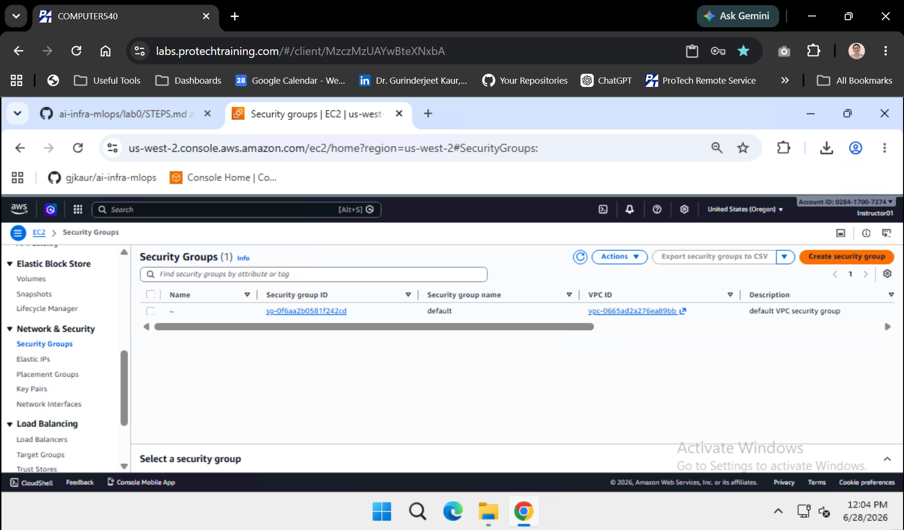

3. Click **Create security group**.
4. **Basic details:**

   | Setting | Value |
   |---------|--------|
   | Security group name | `mlops-lab-sg` |
   | Description | `SSH access for MLOps lab EC2` |
   | VPC | **default** (`vpc-…` — any default VPC in us-west-2 is fine) |

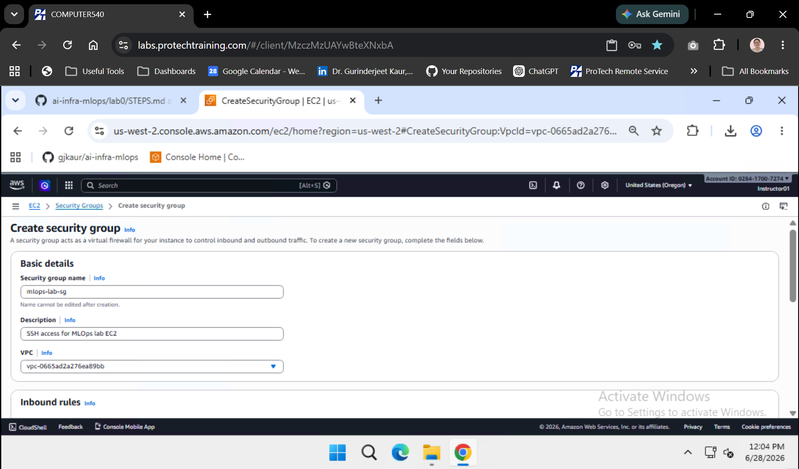

5. **Inbound rules** — click **Add rule** (the list starts empty):

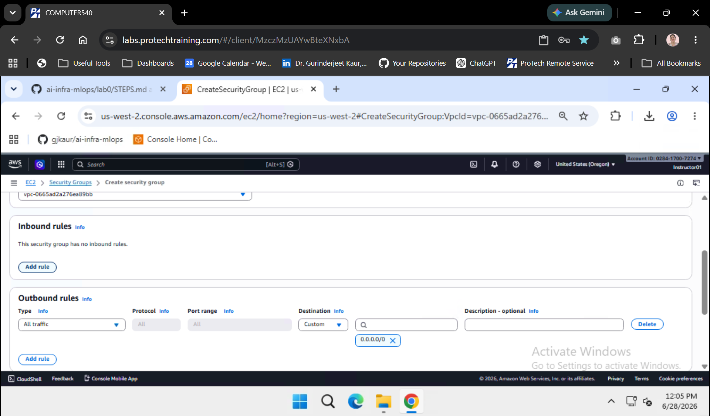

6. Configure the SSH rule:

   | Field | Value |
   |-------|--------|
   | **Type** | **SSH** (search “ssh” in the dropdown) |
   | **Port** | **22** (fills automatically) |
   | **Source** | **My IP** (recommended) |

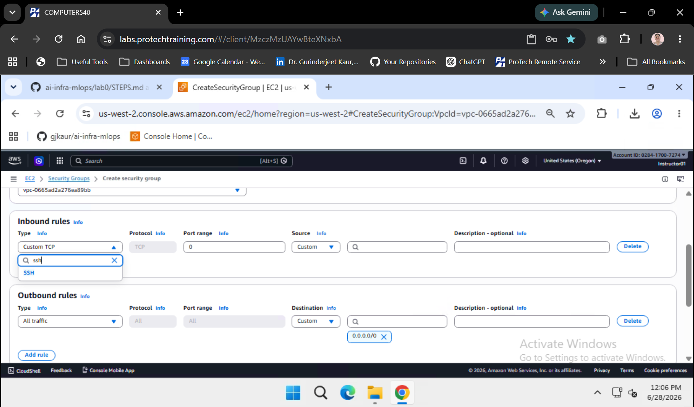

   If **My IP** is greyed out, choose **Anywhere-IPv4** (`0.0.0.0/0`) only when your instructor allows it for class labs.

7. Leave **Outbound rules** as default (all traffic allowed).
8. Click **Create security group**.

**Expected result:** Security groups list shows **`default`** and **`mlops-lab-sg`** (2 total). `mlops-lab-sg` has inbound **SSH (22)** from your IP.

**Instructor example (copy-paste):**

| Setting | Instructor value |
|---------|------------------|
| Security group name | `mlops-lab-sg` |
| Inbound | SSH **22** from **My IP** |

If `mlops-lab-sg` already exists, open it → **Inbound rules** → **Edit** → add **My IP** on port 22 if SSH times out.

---

## Step 9 — Launch your lab EC2 instance (browser)

**Do this:**

1. EC2 left menu → **Instances** → orange **Launch instances** (top right).

2. **Name and tags**

   | Field | Value |
   |-------|--------|
   | Name | `mlops-lab` (students) or `ai-mlops-lab` (instructor) |

3. **Application and OS Images (AMI)**

   | Field | Value |
   |-------|--------|
   | Quick Start | **Amazon Linux** |
   | AMI | **Amazon Linux 2023 AMI** · **64-bit (x86)** |

4. **Instance type**

   | Field | Value |
   |-------|--------|
   | Instance type | **`t3.large`** (2 vCPU, 8 GiB RAM) |

   Use the instance type search box if `t3.large` is not visible.

5. **Key pair (login)**

   | Field | Value |
   |-------|--------|
   | Key pair | Select **`mlops-lab-key`** (or `ai-mlops-instructor`) from Step 7 |

6. **Network settings** — click **Edit** if collapsed:

   | Field | Value |
   |-------|--------|
   | VPC | **default** |
   | Subnet | No preference (any default subnet) |
   | Auto-assign public IP | **Enable** |
   | Firewall (security groups) | **Select existing security group** |
   | Security groups | Check **`mlops-lab-sg`** only (uncheck `default` if selected) |

7. **Configure storage**

   | Field | Value |
   |-------|--------|
   | Root volume size | **30** GiB |
   | Volume type | **gp3** |

   **30 GiB is required** — smaller disks cause `pip install` failures in Step 18.

8. **Advanced details** (expand)

   | Field | Value |
   |-------|--------|
   | **IAM instance profile** | **`None`** (default after course teardown) |

   > **You will not see `EC2MLOpsLabProfile` on a fresh account** — teardown deletes it. That is normal. Leave **IAM instance profile** as **None** and complete **Step 17** (`aws configure` with your instructor access keys on EC2).

   **Instructor only (optional):** To attach a role at launch instead of access keys, run this **once** from the ProTech VM (with `aws` configured as `Instructor01`):

   ```bash
   cd ~/ai-infra-mlops && git pull
   python3 scripts/create_ec2_lab_instance_profile.py
   ```

   Wait ~30 seconds, refresh the launch page, then you may select **`EC2MLOpsLabProfile`**. Students should still use **None** + Step 17 unless your handout says otherwise.

9. **Summary** (right panel) should show:

   - Number of instances: **1**
   - AMI: Amazon Linux 2023
   - Instance type: t3.large
   - Security group: mlops-lab-sg

10. Click **Launch instance**.
11. On the success page, click **View all instances**.
12. Wait until:
    - **Instance state:** `Running`
    - **Status check:** `2/2 checks passed` (2–5 minutes)

**Expected result:** One instance named `mlops-lab` in **Running** state with status checks passed.

**Instructor example (copy-paste):**

**Everyone launches a new instance** (after teardown or first-time setup). Use these instructor names if you prefer — same Steps 7–10:

| Setting | Value |
|---------|--------|
| Name | `ai-mlops-lab` |
| AMI | Amazon Linux 2023 |
| Instance type | `t3.large` |
| Key pair | `ai-mlops-instructor` |
| Security group | `mlops-lab-sg` |
| Storage | 30 GiB gp3 |
| IAM instance profile | **None** (or `EC2MLOpsLabProfile` only after running `scripts/create_ec2_lab_instance_profile.py`) |

After launch: EC2 → **Instances** → select your instance → copy **Public IPv4 address** (Step 10).

> **Screenshot:** Capture your own launch wizard screens to `lab0/images/step-09-launch-*.png` if you want a local copy — instructor screenshots for this step are added in a future update.

---

## Step 10 — Note the instance public IP

You need the **public IP** for Step 12 (SSH config). Use **Method 1** unless your instructor says otherwise.

---

### Method 1 — AWS Console (recommended)

**Do this** on the ProTech VM **browser** (no terminal required):

1. Open **EC2** → **Instances** (region **us-west-2**).
2. Click your instance row once (`mlops-lab` or `ai-mlops-lab`).
3. In the **Details** tab (bottom panel), scroll to **Networking**.
4. Copy **Public IPv4 address** (looks like `35.x.x.x` or `54.x.x.x`).
5. Paste it into Notepad — label it `EC2 public IP`.

**Expected result:**

| Field | Expected |
|-------|----------|
| Instance state | **Running** |
| Status check | **2/2 checks passed** |
| Public IPv4 address | A dotted IP (not blank, not `-`) |
| Region (top-right) | **us-west-2** |
| Security groups | `mlops-lab-sg` |

> **Do not use** **Private IPv4 address** (`172.31.x.x`) — that only works inside AWS, not for SSH from the ProTech VM.

**If Public IPv4 is blank or `-`:** wait until status is **Running** and **2/2 checks passed**, or confirm **Auto-assign public IP** was enabled at launch (Step 9).

---

### Method 2 — AWS CLI (optional)

Use this **only after** `aws` works on that machine:

| Where | When |
|-------|------|
| **ProTech VM** | After you run `aws configure` there with instructor keys (not required for Lab 0) |
| **EC2** (VS Code SSH) | After **Step 17** `aws configure` on the instance |

**2a. Test AWS CLI first**

```bash
clear
aws sts get-caller-identity
aws configure get region
```

**Expected:** JSON with your account id; region `us-west-2`.  
If you see `Unable to locate credentials`, use **Method 1 (console)** or complete **Step 17** first.

**2b. List your lab instance (easiest to read)**

Replace `mlops-lab` with your instance name if different:

```bash
clear
aws ec2 describe-instances \
  --region us-west-2 \
  --filters "Name=tag:Name,Values=mlops-lab" "Name=instance-state-name,Values=running" \
  --query "Reservations[].Instances[].[Tags[?Key=='Name']|[0].Value,InstanceId,PublicIpAddress]" \
  --output table
```

**Expected result:**

```text
-------------------------------------------------------
|                  DescribeInstances                  |
+-------------+-----------------------+---------------+
|  mlops-lab  |  i-0abc123def4567890  |  35.x.x.x    |
+-------------+-----------------------+---------------+
```

Copy the IP from the **rightmost column**.

**2c. Print only the IP (one line)**

```bash
clear
aws ec2 describe-instances \
  --region us-west-2 \
  --filters "Name=tag:Name,Values=mlops-lab" "Name=instance-state-name,Values=running" \
  --query "Reservations[0].Instances[0].PublicIpAddress" \
  --output text
```

**Expected result:**

```text
35.x.x.x
```

**If you see `None` or empty output:**

| Cause | Fix |
|-------|-----|
| Instance still **Pending** | Wait 2–5 min; re-run when **Running** |
| Wrong instance name | Use the name from Step 9 (`mlops-lab` / `ai-mlops-lab`) |
| Wrong region | Add `--region us-west-2` or set region in `aws configure` |
| No credentials | Use **Method 1** or complete **Step 17** |

---

**Remember:** This IP **changes** if you **stop** and **start** the instance. After a restart, repeat Step 10 and update Step 12 SSH config.

**Screenshot (optional):** `images/step-10-public-ip.png`

---

## Part 3 — Connect VS Code to your EC2 (ProTech VM)

---

## Step 11 — Install VS Code and Remote SSH (on ProTech VM)

**Do this:**

On your **ProTech VM desktop** (Step 3 — not on EC2 yet):

1. Install [Visual Studio Code](https://code.visualstudio.com/) if not already installed.
2. Open VS Code → **Extensions** (`Ctrl+Shift+X`).
3. Search for **Remote - SSH** (publisher: Microsoft) → **Install**.
4. Optional but helpful: install **Remote Explorer** (same publisher).

**Expected result:** The VS Code status bar can show remote connections; **Remote Explorer** appears in the activity bar (monitor icon).

**Instructor example (copy-paste):**

On ProTech VM **`COMPUTER540`**, install VS Code if needed:

```powershell
winget install Microsoft.VisualStudioCode
```

Then in VS Code → Extensions → install **`ms-vscode-remote.remote-ssh`**.

**Screenshot (optional):** `images/step-08-vscode-remote-ssh-ext.png`

---

## Step 12 — Configure SSH for your EC2 instance (on ProTech VM)

**Do this:**

1. Move your `.pem` file from Step 7 into your SSH folder (if not already there):
   - Windows: `C:\Users\Administrator\.ssh\mlops-lab-key.pem`
   - macOS/Linux: `~/.ssh/mlops-lab-key.pem`

2. **Restrict PEM permissions** (required for SSH) — **ProTech VM only** (Windows):

   SSH will fail with `Permission denied (publickey)` if the `.pem` is too open. Fix it with **PowerShell** on the **ProTech VM desktop** (not inside EC2 yet).

   **2a. Open PowerShell on the ProTech VM**

   | Step | Action |
   |------|--------|
   | 1 | Click the **Windows Start** button (or press the **Windows** key) |
   | 2 | Type **`PowerShell`** |
   | 3 | Click **Windows PowerShell** (blue icon) — **Run as administrator** is **not** required |
   | 4 | A blue window opens with a prompt like `PS C:\Users\Administrator>` |

   **Alternative:** press **`Win + R`**, type `powershell`, press **Enter**.

   **2b. Confirm the PEM file exists**

   Students (`mlops-lab-key.pem`):

   ```powershell
   Test-Path C:\Users\Administrator\.ssh\mlops-lab-key.pem
   ```

   Instructor (`ai-mlops-instructor.pem`):

   ```powershell
   Test-Path C:\Users\Administrator\.ssh\ai-mlops-instructor.pem
   ```

   **Expected:** `True`. If `False`, repeat **Step 7** (move the `.pem` into `C:\Users\Administrator\.ssh\`).

   **2c. Lock down PEM permissions (run each line, press Enter)**

   Students:

   ```powershell
   icacls C:\Users\Administrator\.ssh\mlops-lab-key.pem /inheritance:r
   icacls C:\Users\Administrator\.ssh\mlops-lab-key.pem /grant:r "$($env:USERNAME):(R)"
   icacls C:\Users\Administrator\.ssh\mlops-lab-key.pem
   ```

   Instructor:

   ```powershell
   icacls C:\Users\Administrator\.ssh\ai-mlops-instructor.pem /inheritance:r
   icacls C:\Users\Administrator\.ssh\ai-mlops-instructor.pem /grant:r "$($env:USERNAME):(R)"
   icacls C:\Users\Administrator\.ssh\ai-mlops-instructor.pem
   ```

   **Expected:** Last command lists only **`Administrator:(R)`** (read) for that file — no `Everyone`, no `Users` with full control.

   **macOS/Linux** (if not on ProTech VM):

   ```bash
   chmod 400 ~/.ssh/mlops-lab-key.pem
   ```

3. Create or edit SSH config:
   - **Windows:** `C:\Users\Administrator\.ssh\config`
   - **macOS/Linux:** `~/.ssh/config`

4. Add this block (replace `YOUR_PUBLIC_IP` with the IP from Step 10):

   ```
   Host mlops-lab-ec2
       HostName YOUR_PUBLIC_IP
       User ec2-user
       IdentityFile C:/Users/Administrator/.ssh/mlops-lab-key.pem
   ```

   On macOS/Linux, use `IdentityFile ~/.ssh/mlops-lab-key.pem`.

5. Test SSH from a **local** terminal (optional):

   ```bash
   ssh mlops-lab-ec2
   ```

   Type `exit` after you see the Amazon Linux prompt.

**Expected result:** SSH connects as `ec2-user@...` without a password prompt (key-based auth). First connect may ask to trust the host fingerprint — type `yes`.

**Instructor example (copy-paste):**

**1. Open PowerShell** — Start menu → type **PowerShell** → open **Windows PowerShell**.

**2. PEM permissions** — paste one line at a time:

```powershell
Test-Path C:\Users\Administrator\.ssh\ai-mlops-instructor.pem
icacls C:\Users\Administrator\.ssh\ai-mlops-instructor.pem /inheritance:r
icacls C:\Users\Administrator\.ssh\ai-mlops-instructor.pem /grant:r "$($env:USERNAME):(R)"
icacls C:\Users\Administrator\.ssh\ai-mlops-instructor.pem
```

**Expected:** `True`, then `processed file` messages, then permissions showing **`Administrator:(R)`** only.

**3. SSH config** — edit `C:\Users\Administrator\.ssh\config` (create file if missing). Replace `YOUR_PUBLIC_IP` with the IP from Step 10:

```
Host ai-mlops-lab
    HostName YOUR_PUBLIC_IP
    User ec2-user
    IdentityFile C:/Users/Administrator/.ssh/ai-mlops-instructor.pem
```

**4. Test SSH** (same PowerShell window):

```bash
ssh ai-mlops-lab
```

Type `exit` when you see `[ec2-user@...]$`.

**Screenshot (optional):** `images/step-09-ssh-config.png`

---

## Step 13 — Connect VS Code to EC2 (ProTech VM → remote)

**Do this:**

1. Open **VS Code** on your **ProTech VM** (Step 3).
2. Press **`Ctrl+Shift+P`** → type **`Remote-SSH: Connect to Host`** → select **`ai-mlops-lab`** (instructor) or **`mlops-lab-ec2`** (your own host name from Step 12).
3. Wait for VS Code to install the VS Code Server on EC2 (first connect takes 1–2 minutes).
4. **File → Open Folder** → enter `/home/ec2-user` → **OK**.
5. **Terminal → New Terminal** — confirm the shell is **bash**.
6. Run:

   ```bash
   clear
   whoami
   pwd
   hostname
   ```

**Expected result:**

```text
ec2-user
/home/ec2-user
ip-172-31-xx-xx.us-west-2.compute.internal
```

> **Wrong terminal?** If `whoami` shows **`Administrator`** or hostname **`COMPUTER540`**, you are still on the **ProTech VM** — not EC2. Reconnect with **Remote-SSH: Connect to Host** (step 2). Lab commands (`git`, `aws`, `python3`) run on **EC2 only** after this step.

Status bar shows **`SSH: ai-mlops-lab`** (or your host alias). The integrated terminal prompt looks like:

```text
[ec2-user@ip-172-31-xx-xx ~]$
```

**Instructor example (copy-paste):** After connect, run:

```bash
clear
whoami
hostname
pwd
```

Expected:

```text
ec2-user
ip-172-31-xx-xx.us-west-2.compute.internal
/home/ec2-user
```

From this step onward, **all lab commands** run in this EC2 terminal — not in Windows PowerShell.

**Screenshot (optional):** `images/step-10-vscode-connected.png`

---

## Part 4 — Configure EC2 for the course (VS Code terminal)

From Step 14 onward, all commands run in the **VS Code integrated terminal** connected to EC2 (**bash**).

---

## Step 14 — Verify tools on EC2

**Do this:**

```bash
clear
python3 --version
git --version
aws --version
uname -a
```

**Expected result:**

```text
Python 3.9.x
git version 2.x.x
aws-cli/2.x.x ...
Linux ... amzn2023.x86_64 ...
```

If `aws` is missing:

```bash
sudo dnf install -y awscli
```

If `git` is missing (`bash: git: command not found`):

```bash
sudo dnf install -y git
git --version
```

> **On the ProTech VM (Windows):** `git` is **not** required before Step 13. Do **not** run `git clone` in PowerShell, Git Bash, or CMD on the VM — clone the repo in **Step 15** on **EC2** after VS Code SSH connects.

**Instructor example (copy-paste):**

```bash
clear
python3 --version
git --version
aws --version
uname -a
```

Expected (versions may vary slightly):

```text
Python 3.9.25
git version 2.50.1
aws-cli/2.33.15 Python/3.9.25 Linux/6.12.92-122.166.amzn2023.x86_64 source/x86_64.amzn.2023
Linux ... amzn2023.x86_64 GNU/Linux
```

**Screenshot (optional):** `images/step-11-tools.png`

---

## Step 15 — Clone the course repo on EC2

**Do this:**

```bash
clear
cd ~
git clone https://github.com/gjkaur/ai-infra-mlops.git
cd ai-infra-mlops
git pull
ls -1
```

**Expected result:**

```text
CLOUD-DELIVERY.md
README.md
docs
lab0
lab1
lab2
...
scripts
```

**Instructor example (copy-paste):**

If repo already exists, pull instead of clone:

```bash
clear
cd ~
if [ -d ai-infra-mlops ]; then cd ai-infra-mlops && git pull; else git clone https://github.com/gjkaur/ai-infra-mlops.git && cd ai-infra-mlops; fi
ls -1
```

**Screenshot (optional):** `images/step-12-clone.png`

---

## Step 16 — Open the lab0 folder in VS Code

**Do this:**

1. **File → Open Folder** → `/home/ec2-user/ai-infra-mlops`
2. In the terminal:

   ```bash
   clear
   cd ~/ai-infra-mlops/lab0
   ls -1
   ```

**Expected result:**

```text
STEPS.md
config
images
requirements.txt
scripts
```

**Instructor example (copy-paste):**

VS Code: **File → Open Folder** → paste:

```
/home/ec2-user/ai-infra-mlops
```

Terminal:

```bash
clear
cd ~/ai-infra-mlops/lab0 && ls -1
```

**Screenshot (optional):** `images/step-13-lab0-folder.png`

---

## Step 17 — Configure AWS CLI on EC2

**Do this:**

Configure the CLI with **access keys from your handout** (demo/training account). Keys stay on this EC2 instance only.

```bash
clear
aws configure set region us-west-2
aws configure set output json
aws configure set aws_access_key_id YOUR_ACCESS_KEY_ID
aws configure set aws_secret_access_key YOUR_SECRET_ACCESS_KEY
aws sts get-caller-identity
aws configure get region
```

Replace `YOUR_ACCESS_KEY_ID` and `YOUR_SECRET_ACCESS_KEY` with values from the handout — do not commit them.

**Expected result:**

```text
{
    "UserId": "...",
    "Account": "028417007274",
    "Arn": "arn:aws:iam::028417007274:user/Instructor01"
}
us-west-2
```

Account ID and ARN will match your assigned user. Region must be **`us-west-2`**.

**Alternative:** If your instance has an IAM **instance profile**, `aws sts get-caller-identity` may show an `assumed-role` ARN instead of a user — that is OK if your instructor confirms the role has lab permissions.

**Instructor example (copy-paste):**

**Option A — access keys** (paste keys from handout when prompted; not stored in git):

```bash
clear
aws configure set region us-west-2
aws configure set output json
aws configure
```

At the prompts, enter access key ID and secret from the handout. Then:

```bash
aws sts get-caller-identity
aws configure get region
```

Expected:

```text
{
    "UserId": "AIDAXXXXXXXXXXXXXXXXX",
    "Account": "028417007274",
    "Arn": "arn:aws:iam::028417007274:user/Instructor01"
}
us-west-2
```

**Option B — instance profile** (no keys; `ai-mlops-lab` with `EC2MLOpsLabProfile`):

```bash
clear
aws configure set region us-west-2
aws configure set output json
aws sts get-caller-identity
aws configure get region
```

Expected:

```text
{
    "UserId": "AROAQNHOJD2VP3ODHKF4S:i-0326933d0bc3b45f1",
    "Account": "028417007274",
    "Arn": "arn:aws:sts::028417007274:assumed-role/EC2MLOpsLabRole/i-0326933d0bc3b45f1"
}
us-west-2
```

Quick S3 check:

```bash
aws s3 ls --region us-west-2 | head -5
```

**Screenshot (optional):** `images/step-14-aws-cli.png`

---

## Step 18 — Install Python packages

**Do this:**

```bash
clear
cd ~/ai-infra-mlops/lab0
python3 -m pip install --upgrade pip
pip install -r requirements.txt
pip install -r ../lab1/requirements.txt
pip install -r ../lab2/requirements.txt
python3 scripts/test_imports.py
```

**Expected result:**

```text
All imports successful!
```

If pip fails with **no space left on device**, return to Step 9 and increase the root volume to **30 GiB**, then expand the filesystem or relaunch the instance.

**Instructor example (copy-paste):**

```bash
clear
cd ~/ai-infra-mlops/lab0
python3 -m pip install --upgrade pip
pip install -r requirements.txt
pip install -r ../lab1/requirements.txt
pip install -r ../lab2/requirements.txt
python3 scripts/test_imports.py
```

Expected last line:

```text
All imports successful!
```

**Screenshot (optional):** `images/step-15-pip.png`

---

## Step 19 — Install Docker on EC2 (required before Lab 5)

**Do this:**

```bash
clear
sudo dnf install -y docker
sudo systemctl enable --now docker
sudo usermod -aG docker ec2-user
docker --version
```

**Expected result:**

```text
Docker version 25.x.x, build ...
```

**Important:** Disconnect VS Code Remote SSH and **reconnect** so the `docker` group applies. Then verify:

```bash
docker ps
```

**Expected result:** Empty table (no error). If `permission denied`, reconnect SSH or run `newgrp docker` once.

**Screenshot (optional):** `images/step-19-docker.png`

---

## Step 20 — Set classroom environment variables

**Do this:**

```bash
clear
source ~/ai-infra-mlops/lab0/scripts/setup_classroom_env.sh
grep LAB_ ~/.bashrc || { echo 'export LAB_NUM_RECORDS=1000' >> ~/.bashrc; echo 'export LAB_USE_COMPREHEND=0' >> ~/.bashrc; }
echo $LAB_NUM_RECORDS $LAB_USE_COMPREHEND
```

**Expected result:**

```text
MLOps lab env: LAB_NUM_RECORDS=1000 LAB_USE_COMPREHEND=0 region=us-west-2
1000 0
```

**Instructor example (copy-paste):**

```bash
clear
source ~/ai-infra-mlops/lab0/scripts/setup_classroom_env.sh
grep LAB_ ~/.bashrc || { echo 'export LAB_NUM_RECORDS=1000' >> ~/.bashrc; echo 'export LAB_USE_COMPREHEND=0' >> ~/.bashrc; }
echo $LAB_NUM_RECORDS $LAB_USE_COMPREHEND
```

**Screenshot (optional):** `images/step-16-env.png`

---

## Step 21 — Create the student workspace

**Do this:**

```bash
clear
cd ~/ai-infra-mlops/lab0
python3 scripts/setup_lab_directories.py
ls ../workspace
```

**Expected result:**

```text
Creating Banking MLOps Lab Directory Structure
============================================================
   Target: /home/ec2-user/ai-infra-mlops/workspace
   Directories created: 15
   Mapping file: .../workspace/config/labs_mapping.json

Directory structure ready.
config  lab1  lab2  lab3  ...  logs  results  scripts  shared_data
```

**Instructor example (copy-paste):**

```bash
clear
cd ~/ai-infra-mlops/lab0
python3 scripts/setup_lab_directories.py
ls ../workspace
```

**Screenshot (optional):** `images/step-17-workspace.png`

---

## Step 22 — Verify the full environment

**Do this:**

```bash
clear
cd ~/ai-infra-mlops/lab0
python3 scripts/run_lab0_setup.py
python3 scripts/verify_environment.py
```

**Expected result:**

```text
Banking MLOps Environment Verification
============================================================
   [PASS] Python Version: Python 3.9.x
   [PASS] Required Packages: Installed: 12, Missing: 0
   [PASS] Default Region Config: us-west-2
   [PASS] AWS CLI Region: Region: us-west-2
   [PASS] AWS CLI Credentials: Arn: arn:aws:...
   [PASS] Boto3 AWS Access: Account: ...
   [PASS] Course Lab Folders: Found 11 lab folder(s) in repo
   [PASS] Student Workspace: Workspace: /home/ec2-user/ai-infra-mlops/workspace (0 missing)
   [PASS] Git Repository: Repo cloned

============================================================
Verification Summary:
   Total Checks: 9
   Passed: 9
   Failed: 0

ALL CHECKS PASSED. Environment is ready.
   Proceed to Lab 1 (open lab1/STEPS.md)

Results saved: /home/ec2-user/ai-infra-mlops/lab0/logs/verification_results.json
```

**Instructor example (copy-paste):**

```bash
clear
cd ~/ai-infra-mlops/lab0
python3 scripts/run_lab0_setup.py
python3 scripts/verify_environment.py
```

Expected summary (account/ARN matches Option A or B from Step 17):

```text
Banking MLOps Environment Verification
============================================================
   [PASS] Python Version: Python 3.9.25
   [PASS] Required Packages: Installed: 12, Missing: 0
   [PASS] Default Region Config: us-west-2
   [PASS] AWS CLI Region: Region: us-west-2
   [PASS] AWS CLI Credentials: Arn: arn:aws:sts::028417007274:assumed-role/EC2MLOpsLabRole/i-0326933d0bc3b45f1
   [PASS] Boto3 AWS Access: Account: 028417007274
   [PASS] Course Lab Folders: Found 11 lab folder(s) in repo
   [PASS] Student Workspace: Workspace: /home/ec2-user/ai-infra-mlops/workspace (0 missing)
   [PASS] Git Repository: Repo cloned

============================================================
Verification Summary:
   Total Checks: 9
   Passed: 9
   Failed: 0

ALL CHECKS PASSED. Environment is ready.
   Proceed to Lab 1 (open lab1/STEPS.md)
```

**Screenshot (optional):** `images/step-18-verify-pass.png`

---

## Instructor reference — copy-paste (this class)

Passwords and access keys: **instructor handout only** (not in git).

| Field | Copy this value |
|-------|-----------------|
| **ProTech portal** | `https://labs.protechtraining.com` |
| **ProTech portal user** | `PTACCESS540` |
| **ProTech host** | `COMPUTER540` |
| **VM Windows user** | `Administrator` |
| **AWS sign-in URL** | `https://iis-instructor-03.signin.aws.amazon.com/console` |
| **Account ID** | `028417007274` |
| **IAM user name** | `Instructor01` (case-sensitive) |
| **Console region** | `us-west-2` (United States Oregon) |

**Pre-built instructor EC2:** Only if your instructor says an instance is already running — confirm **Running** in EC2 → **Instances**, then go to **Step 10** for the public IP. **Default (fresh cohort / after teardown):** complete **Steps 7–10** to create EC2 first.

| Field | Copy this value |
|-------|-----------------|
| Instance name (instructor) | `ai-mlops-lab` |
| Instance name (students) | `mlops-lab` |
| Key pair name (instructor) | `ai-mlops-instructor` |
| Key pair name (students) | `mlops-lab-key` |
| PEM file (ProTech VM) | `C:\Users\Administrator\.ssh\ai-mlops-instructor.pem` |
| SSH user | `ec2-user` |
| Security group | `mlops-lab-sg` |
| IAM instance profile | **None** for fresh setup; optional `EC2MLOpsLabProfile` (instructor script) |
| Root volume | 30 GiB |

**Refresh public IP** (after stop/start): repeat **Step 10 Method 1** in the EC2 console, or **Method 2b** if `aws` is configured. Update `HostName` in SSH config (Step 12).

---

## Troubleshooting

| Issue | Fix |
|-------|-----|
| Cannot sign in to ProTech portal | Check **User ID** / password from handout; use [labs.protechtraining.com](https://labs.protechtraining.com) |
| VM will not connect | Start host on portal; retry **Connect**; confirm **COMPUTER###** matches handout |
| SSH timeout | Instance running? Correct **public IP** in SSH config? Security group allows **port 22** from your IP? |
| `Permission denied (publickey)` | Step 12: PEM at `C:\Users\Administrator\.ssh\`; run **icacls** in PowerShell (Start → type PowerShell); SSH user **`ec2-user`** |
| Wrong region in console | Set **us-west-2** and open EC2 (Step 6) before creating the instance |
| No EC2 instance yet | Complete **Steps 7–10** (key pair, security group, launch) before VS Code (Step 11) |
| Only 1 security group (`default`) | Normal **before** Step 8 — create **`mlops-lab-sg`** in Step 8 |
| Lost `.pem` file | Create a new key pair + launch a new instance (cannot re-download) |
| No `EC2MLOpsLabProfile` in launch wizard | **Expected after teardown** — set **None**; use Step 17 `aws configure`. Instructor: `python3 scripts/create_ec2_lab_instance_profile.py` then refresh launch page |
| PEM in `Downloads\.ssh` | Move to `C:\Users\Administrator\.ssh\` (Step 7) — Step 12 expects the profile `.ssh` folder |
| Public IP changed | Repeat Step 10 (console or CLI); update `HostName` in `C:\Users\Administrator\.ssh\config` |
| `aws describe-instances` returns `None` | Instance not **Running** yet, wrong name, or `aws` not configured — use Step 10 **Method 1** |
| `bash: git: command not found` | Run on **EC2** (Step 13 SSH connected, `whoami` = `ec2-user`): `sudo dnf install -y git`. If on ProTech VM, connect VS Code to EC2 first — do not use `git` on Windows for labs |
| Pip / disk full | Root volume **30 GiB** minimum (Step 9) |
| `docker: permission denied` | Complete Step 19, then **reconnect** VS Code SSH |
| `docker: command not found` | Re-run Lab 0 Step 19 |

---

## Lab 0 complete → [Lab 1](../lab1/STEPS.md)
