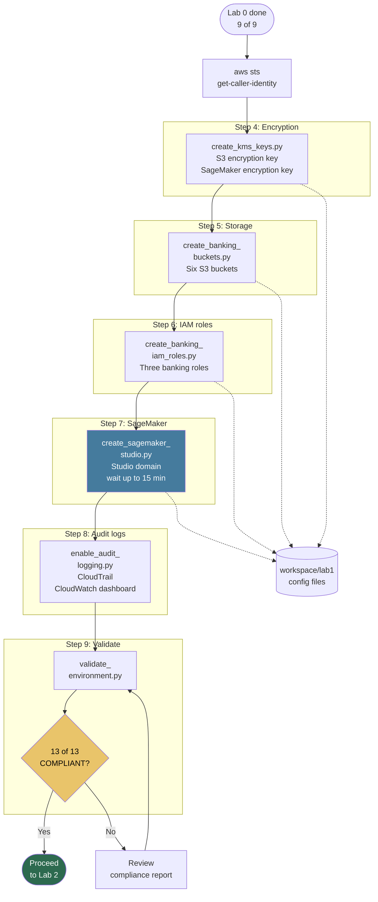

# Lab 1: Secure MLOps Environment Setup

**Class:** `ai-mlops-2026-jun30` · **Region:** `us-west-2` · **Duration:** ~30–45 min

Hands-on steps: [STEPS.md](STEPS.md)

---

## Terms & acronyms (beginners)

| Term | Full form / meaning |
|------|---------------------|
| **AWS** | **Amazon Web Services** |
| **KMS** | **Key Management Service** — creates and manages encryption keys |
| **S3** | **Simple Storage Service** — object storage (files/buckets) in the cloud |
| **IAM** | **Identity and Access Management** — users, roles, and permissions |
| **ARN** | **Amazon Resource Name** — unique ID for an AWS resource (e.g. a role or bucket) |
| **SCP** | **Service Control Policy** — organization-level guardrails (reference pattern in this lab) |
| **VPC** | **Virtual Private Cloud** — isolated network for AWS resources |
| **SageMaker** | AWS **managed machine learning** service (training, notebooks, deployment) |
| **CloudTrail** | AWS **audit log** service — records API calls for compliance |
| **CloudWatch** | AWS **monitoring** service — metrics, dashboards, and alarms |
| **MLOps** | **Machine Learning Operations** |
| **JSON** | **JavaScript Object Notation** — config file format |

---

## Overview

Lab 1 provisions the **secure AWS foundation** for the banking MLOps course. You create encryption keys, compliant S3 buckets, least-privilege IAM roles, a SageMaker Studio domain, and CloudTrail audit logging. Every later lab depends on these resources.

This lab writes configuration JSON files to `workspace/lab1/config/` and creates real AWS resources in `us-west-2`.

---

## Prerequisites

- Lab 0 complete — **9/9** environment checks passed
- EC2 instance with PowerUser (or equivalent) AWS access

---

## Lab flowchart

## Lab flow

| Step | Script | AWS resources |
|------|--------|---------------|
| 4 | `create_kms_keys.py` | KMS keys for S3 and SageMaker |
| 5 | `create_banking_buckets.py` | 6 S3 buckets (raw, processed, models, monitoring, governance, audit) |
| 6 | `create_banking_iam_roles.py` | 3 IAM roles + inline policies |
| 7 | `create_sagemaker_studio.py` | SageMaker Studio domain (**longest wait**, up to ~15 min) |
| 8 | `enable_audit_logging.py` | CloudTrail trail, S3 audit bucket, CloudWatch dashboard |
| 9 | `validate_environment.py` | Reads all configs; 13 compliance checks |

**Quick run:** `python3 scripts/run_lab1.py` (Steps 4–9 in order).

**Success gate:** **13/13 COMPLIANT** → [Lab 2](../lab2/STEPS.md).

---

## Scripts reference

### `create_kms_keys.py`

Creates two customer-managed KMS keys:

- **S3 key** — encrypts all banking S3 buckets
- **SageMaker key** — encrypts Studio and later SageMaker resources

Saves key ARNs to `workspace/lab1/config/kms_keys.json`.

### `create_banking_buckets.py`

Creates six S3 buckets with:

- KMS default encryption
- Block public access
- Versioning (where required)
- Bucket policies referencing Lab 1 IAM roles

Writes `workspace/lab1/config/buckets.json` with bucket names and ARNs.

### `create_banking_iam_roles.py`

Creates three banking personas:

| Role | Typical use |
|------|-------------|
| `BankingDataScientistRole` | Data exploration, Feature Store read |
| `BankingMLEngineerRole` | Training, pipelines, deployment, ECR |
| `BankingComplianceOfficerRole` | Audit read, governance reports |

Each role gets least-privilege inline policies scoped to course resources. Also saves `region_restriction_policy.json` as a reference SCP pattern.

**Note:** Re-run this script when later labs add IAM permissions (Labs 8–9 pipeline/governance needs).

### `create_sagemaker_studio.py`

Creates a SageMaker Studio domain with VPC settings and the SageMaker KMS key. Saves domain ID and URL to `sagemaker_studio.json`.

### `enable_audit_logging.py`

Enables multi-region CloudTrail, ships logs to the audit S3 bucket, and creates a CloudWatch dashboard for API activity review.

### `validate_environment.py`

Validates that all JSON configs exist and required AWS resources respond. Produces `workspace/lab1/results/compliance_report.json`.

### `lab_paths.py`

Shared helper — resolves paths under `workspace/lab1/` (`CONFIG_DIR`, `RESULTS_DIR`, etc.).

### Instructor reset scripts (not in student flow)

- `cleanup_lab1.py`, `delete_banking_buckets.py`, `delete_sagemaker_studio.py`, `delete_audit_logging.py` — tear down Lab 1 resources for re-runs.

---

## Configuration & outputs

**Repo:** `config/lab_config.json`, `requirements.txt`

**Workspace (`workspace/lab1/`):**

| Path | Created by |
|------|------------|
| `config/kms_keys.json` | Step 4 |
| `config/buckets.json` | Step 5 |
| `config/iam_roles.json` | Step 6 |
| `config/sagemaker_studio.json` | Step 7 |
| `config/region_restriction_policy.json` | Step 6 |
| `results/compliance_report.json` | Step 9 |

---

## Architecture role

Lab 1 is the **security layer** in the enterprise assessment (Lab 10). Evidence files: `buckets.json`, `iam_roles.json`.

---

## Next lab

[Lab 2: Banking Data Management & PII Protection](../lab2/README.md)
