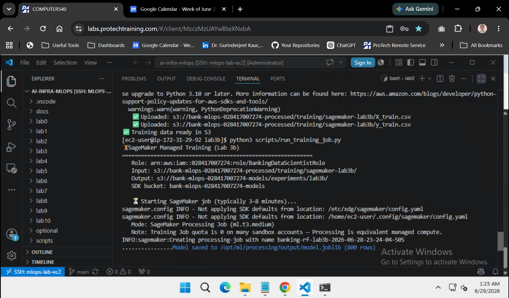

# Lab 3: Model Training & Fairness Testing

| | |
|---|---|
| **Class** | `ai-mlops-2026-jun30` |
| **Duration** | ~30 minutes (Steps 1–9) · ~45 minutes (Steps 10–13, SageMaker on AWS) |
| **Region** | `us-west-2` |
| **Platform** | EC2 · [VS Code Remote SSH](../docs/SSH-VSCODE-SETUP.md) · **bash** |
| **Prerequisite** | [Lab 2](../lab2/STEPS.md) complete — Step 11 validation passed |
| **Working directory** | `~/ai-infra-mlops/lab3` |
| **Outputs** | `~/ai-infra-mlops/workspace/lab3/` |

> **Run Steps 1–9 once, in order.** Run each command block below, then compare your terminal to the screenshot under that step.  
> All commands run in the **VS Code terminal on EC2** (`whoami` = `ec2-user`). Do not use Windows PowerShell on the ProTech VM.

---

## Before you start

1. Connect VS Code to EC2 ([Lab 0 Step 13](../lab0/STEPS.md)).
2. Pull the latest course repo:

```bash
cd ~/ai-infra-mlops && git pull
whoami
```

**Expected:** `ec2-user`


3. Confirm Lab 2 outputs exist:

```bash
cd ~/ai-infra-mlops/lab2 && python3 scripts/validate_lab2.py
```

**Expected:** All data and config files show ✅ (no `⚠️ not yet created` for Step 11 artifacts).


4. Go to Lab 3:

```bash
cd ~/ai-infra-mlops/lab3
```

---

## Lab 3 roadmap

| Step | What you create |
|------|-----------------|
| **1–3** | Confirm repo, workspace, and Python packages |
| **4** | Train/test splits from Lab 2 engineered data |
| **5** | Three baseline models (Logistic Regression, Random Forest, XGBoost) |
| **6** | SageMaker Experiments tracking record |
| **7** | Fairness report (disparate impact on `age_group`) |
| **8** | Best model selection + final training report |
| **9** | Lab 3 validation (EC2 training path) |
| **10–13** | **SageMaker managed job on AWS** (upload data, Processing job, validate) |

---

# Step 1 — Confirm lab3 in repo

**What you do:** Verify the Lab 3 course files are in the repo.

```bash
cd ~/ai-infra-mlops
ls -1 lab3
```

**Expected:**

```text
STEPS.md
config
images
requirements.txt
scripts
```


---

# Step 2 — Confirm workspace

**What you do:** Verify Lab 0 created your Lab 3 output folders under `workspace/`.

```bash
cd ~/ai-infra-mlops/lab3
ls -1 ../workspace/lab3
```

**Expected:**

```text
config
data
logs
results
scripts
```

If the folder is missing, re-run [Lab 0 Step 16](../lab0/STEPS.md) (`setup_lab_directories.py`), then return here.


---

# Step 3 — Install lab3 packages

**What you do:** Install ML libraries for training and fairness testing.

```bash
cd ~/ai-infra-mlops/lab3
python3 -m pip install -r requirements.txt
python3 -c "import sklearn, xgboost, sagemaker; print('Lab 3 imports OK')"
```

**Expected:** `Lab 3 imports OK`

> If you completed [Lab 0 Step 18](../lab0/STEPS.md), packages may already be installed — re-running `pip install` is safe.

---

# Step 4 — Load training data (copies Lab 2 artifacts)

**What you do:** Copy Lab 2 engineered data and create stratified train/test splits.

```bash
python3 scripts/load_training_data.py
```

**Expected:**

```text
📂 Loading Lab 2 Training Data
============================================================
   ✅ Copied: engineered_banking_data.csv
   ✅ Copied: anonymized_customers.csv
   ✅ Copied: anonymized_transactions.csv
   ✅ Copied: feature_metadata.json
   ✅ Copied: preprocessor.pkl

   Records: 1000
   Features: 30
   Train: 800 / Test: 200
✅ Training data prepared
```


---

# Step 5 — Train baseline models

**What you do:** Train three classifiers to predict `high_risk` and save metrics.

```bash
python3 scripts/train_models.py
```

**Expected:**

```text
🏦 Training Banking Risk Models
============================================================
   ✅ LogisticRegression — AUC: 0.81
   ✅ RandomForest — AUC: 1.00
   ✅ XGBoost — AUC: 1.00
✅ Model training complete
```

A `ConvergenceWarning` from LogisticRegression is **expected** on unscaled numeric features — Random Forest and XGBoost are the primary models for this lab.


---

# Step 6 — SageMaker Experiments tracking

**What you do:** Register a SageMaker Experiment and Trial with your training metrics.

```bash
python3 scripts/sagemaker_experiments.py
```

**Expected:**

```text
📊 SageMaker Experiments
============================================================
   ✅ Experiment: banking-risk-experiments
   ✅ Trial: trial-randomforest-YYYYMMDDHHMMSS
   ✅ Metrics recorded locally: 3 models
   ✅ Metrics logged: auc, accuracy, f1
✅ Experiment tracking complete
```

On re-run, you may see `ResourceInUse` for the experiment — that is OK. If AWS calls fail, the script still saves `config/experiment_tracking.json` locally.


---

# Step 7 — Fairness testing

**What you do:** Measure disparate impact across the `age_group` protected attribute.

```bash
python3 scripts/fairness_testing.py
```

**Expected:**

```text
⚖️ Fairness Testing
============================================================
   Protected attribute: age_group
   Disparate impact ratio: 0.84
   Status: PASS (within banking threshold)
✅ Fairness report saved: results/fairness_report.json
```


---

# Step 8 — Select best model

**What you do:** Pick the best model using combined performance + fairness score.

```bash
python3 scripts/select_best_model.py
ls -1 ../workspace/lab3/models
```

**Expected:**

```text
📋 Banking Model Selection
============================================================
   LogisticRegression: combined=0.886 AUC=0.81
   RandomForest: combined=1.000 AUC=1.00
   XGBoost: combined=1.000 AUC=1.00

✅ Best model: RandomForest (AUC 1.00, fairness PASS)
   Saved: models/best_model.pkl
```

You should also see `logisticregression_model.pkl`, `randomforest_model.pkl`, and `xgboost_model.pkl` in `models/`.


---

# Step 9 — Validate lab3

**What you do:** Confirm all Lab 3 outputs exist.

```bash
python3 scripts/validate_lab3.py
```

**Expected:**

```text
Validate Lab 3
============================================================
   ✅ Lab 2: engineered_banking_data.csv
   ✅ Lab 2: feature_metadata.json
   ✅ data: X_train.csv
   ✅ models: best_model.pkl
   ✅ results: fairness_report.json
   ✅ results: training_report_final.json
   ✅ config: training_results.json

============================================================
Prerequisites OK — proceed to Step 10
```


---

# Step 10 — Upload training data to S3 (SageMaker)

**What you do:** Copy Lab 3 train CSVs to S3 for a SageMaker managed job.

```bash
cd ~/ai-infra-mlops/optional/lab3b
python3 -m pip install -r requirements.txt
python3 scripts/upload_training_data.py
```

**Expected:**

```text
📤 Upload training data for SageMaker
============================================================
   ✅ Uploaded: s3://bank-mlops-<account-id>-processed/training/sagemaker-lab3b/X_train.csv
   ✅ Uploaded: s3://bank-mlops-<account-id>-processed/training/sagemaker-lab3b/y_train.csv
✅ Training data ready in S3
```


---

# Step 11 — Run SageMaker managed job

**What you do:** Launch a SageMaker **Processing Job** (`ml.t3.medium`) that trains the same Random Forest on AWS managed compute.

```bash
python3 scripts/run_training_job.py
```

**Expected:**

```text
🏋️ SageMaker Managed Training (Lab 3b)
============================================================
   Mode: SageMaker Processing Job (ml.t3.medium)
   ...
   ✅ SageMaker job: banking-rf-lab3b-... (processing)
✅ SageMaker managed training complete
```

> **Console:** SageMaker → **Processing** → **Processing jobs**. Sandbox accounts often have Training Job quota **0** — the script uses Processing instead.

If IAM/S3 errors appear:

```bash
python3 scripts/patch_iam_for_sagemaker.py
sleep 10
python3 scripts/run_training_job.py
```



---

# Step 12 — Validate SageMaker job

```bash
python3 scripts/validate_lab3b.py
```

**Expected:**

```text
Validate Lab 3b (SageMaker managed job)
============================================================
   ✅ Processing job in AWS: banking-rf-lab3b-...
   ✅ Status: Completed
   ...
============================================================
Lab 3b OK — SageMaker job visible in AWS console
```


---

# Step 13 — SageMaker cleanup notes

```bash
python3 scripts/teardown_lab3b.py
```

Documents where artifacts live. Delete S3 objects under `experiments/lab3b/` later if you want to reduce storage cost.

| | Steps 1–9 (EC2) | Steps 10–13 (AWS) |
|---|-----------------|-------------------|
| Compute | EC2 CPU | SageMaker Processing `ml.t3.medium` |
| Model file | `workspace/lab3/models/best_model.pkl` | `model.joblib` in S3 under `experiments/lab3b/` |

---

## Troubleshooting

| Issue | Fix |
|-------|-----|
| `whoami` = `Administrator` | Reconnect VS Code Remote-SSH to EC2 ([Lab 0 Step 13](../lab0/STEPS.md)) |
| `Missing Lab 2 artifact` | Complete [Lab 2](../lab2/STEPS.md) Steps 4–11 first |
| `ModuleNotFoundError: xgboost` | Run Step 3 — `python3 -m pip install -r requirements.txt` |
| `No such file: training_results.json` | Run Step 5 before Steps 6–8 |
| `No such file: fairness_report.json` | Run Step 7 before Step 8 |
| SageMaker Experiments warning | OK if `experiment_tracking.json` was saved — check Step 6 output |
| `ResourceLimitExceeded` (training quota **0**) | Expected — Step 11 uses **Processing Job**; `git pull` for latest `run_training_job.py` |
| `s3:ListBucket` denied on SageMaker bucket | Run `python3 scripts/patch_iam_for_sagemaker.py` in `optional/lab3b`, wait 10s, retry Step 11 |
| `TypeError: source_dir` on Processing job | `git pull` — fixed in recent repo |
| SageMaker job stuck **InProgress** | Wait up to 10 min; CloudWatch → `/aws/sagemaker/ProcessingJobs` |
| Screenshot shows the **next** step's command at the bottom | Normal — captures were taken in one continuous terminal session |
| `PythonDeprecationWarning` | [Lab 0 Step 17a](../lab0/STEPS.md) — upgrade to Python 3.11 |

---

## Appendix — Fresh start (optional)

**Reset Lab 3 workspace only:**

```bash
cd ~/ai-infra-mlops
python3 scripts/reset_course.py --labs lab3
cd lab3
```

Then re-run **Steps 4–13**. Lab 2 artifacts in `workspace/lab2/` are unchanged.

**Quick run (Steps 1–9 scripts only):** `python3 scripts/run_lab3.py` — then run Steps 9–13 to validate.

---

## Lab 3 complete → [Lab 4](../lab4/STEPS.md)
