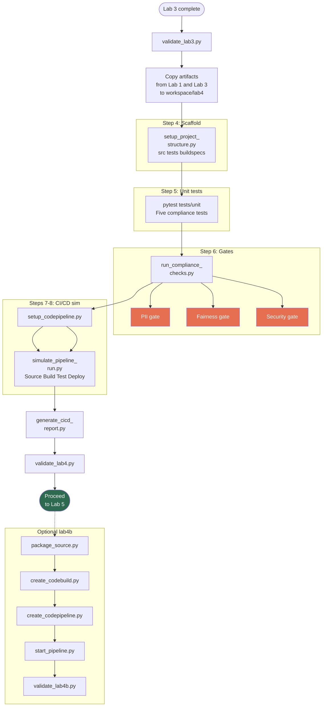

# Lab 4: CI/CD Pipeline with Compliance Gates

**Class:** `ai-mlops-2026-jun30` · **Module 5:** CI/CD for Machine Learning · **Duration:** ~30 min (+ optional ~45 min real CodePipeline)

Hands-on steps: [STEPS.md](STEPS.md)

---

## Terms & acronyms (beginners)

| Term | Full form / meaning |
|------|---------------------|
| **CI/CD** | **Continuous Integration / Continuous Delivery** — automated software/ML release pipeline |
| **ML** | **Machine Learning** |
| **PII** | **Personally Identifiable Information** |
| **AWS CodePipeline** | AWS service that **orchestrates** build, test, and deploy stages |
| **AWS CodeBuild** | AWS **build** service — compiles/tests code in the cloud (optional lab4b) |
| **pytest** | Python **unit testing** framework |
| **Compliance gate** | Automated **check that must pass** before deployment (PII, fairness, security) |
| **Simulation** | Classroom mode that **records** pipeline steps locally without creating real AWS CodePipeline |

---

## Overview

Lab 4 introduces **ML CI/CD** with automated compliance gates. You scaffold a pipeline project, run unit tests, enforce PII/fairness/security checks, simulate a CodePipeline run, and generate a CI/CD compliance report.

The default path **simulates** CodePipeline locally. Optional Steps 11–15 in `optional/lab4b/` deploy a real AWS CodePipeline + CodeBuild project.

---

## Prerequisites

- Labs 1–3 complete
- `workspace/lab3/models/best_model.pkl` and `results/fairness_report.json`

---

## Lab flowchart

## Lab flow

| Step | Script / command | Purpose |
|------|------------------|---------|
| 2 | Manual `cp` | Copy `buckets.json`, `iam_roles.json`, `best_model.pkl` |
| 4 | `setup_project_structure.py` | Create `src/`, `tests/`, `buildspecs/` layout |
| 5 | `pytest tests/unit -q` | Five compliance-oriented unit tests |
| 6 | `run_compliance_checks.py` | Gate checks; writes `compliance_gates.json` |
| 7 | `setup_codepipeline.py` | Pipeline stage definitions (classroom simulation) |
| 8 | `simulate_pipeline_run.py` | Simulates Source → Build → Test → Deploy stages |
| 9 | `generate_cicd_report.py` | Final CI/CD compliance JSON |
| 10 | `validate_lab4.py` | Gate to Lab 5 |

**Quick run:** `python3 scripts/run_lab4.py` (does not include pytest or validate).

---

## Scripts reference

### `setup_project_structure.py`

Creates standard CI/CD directories under `workspace/lab4/`:

- `src/compliance/` — compliance helper modules
- `tests/unit/` — pytest tests
- `tests/reports/` — test output
- `buildspecs/` — CodeBuild buildspec templates

### `run_compliance_checks.py`

Runs three gates before any deployment:

1. **PII gate** — Lab 2 PII report shows remediation
2. **Fairness gate** — Lab 3 disparate impact ≥ 0.80
3. **Security gate** — Lab 1 IAM and encryption configs present

Writes `config/compliance_gates.json` and copies fairness report to `results/`.

### `setup_codepipeline.py`

Generates `codepipeline_config.json` describing stages (Source, Build, ComplianceTest, Deploy) aligned with banking MLOps best practices. In simulation mode, no AWS pipeline is created.

### `simulate_pipeline_run.py`

Walks through each pipeline stage, recording timestamps and pass/fail. Output: `artifacts/pipeline_run_simulation.json`.

### `generate_cicd_report.py`

Aggregates gate results and simulation log into `artifacts/cicd_compliance_report_final.json`.

### `validate_lab4.py`

Checks project structure, compliance gates passed, simulation artifact exists.

### `run_lab4.py`

Orchestrates structure → compliance → pipeline config → simulate → report.

### `tests/unit/test_compliance.py`

Pytest module verifying Labs 1–3 artifacts are present and meet minimum compliance criteria (5 tests).

### `lab_paths.py`

Paths under `workspace/lab4/`.

### Optional: `optional/lab4b/scripts/`

Real AWS CI/CD: `package_source.py`, `create_codebuild.py`, `create_codepipeline.py`, `start_pipeline.py`, `validate_lab4b.py`, `teardown_lab4b.py`.

---

## Configuration & outputs

**Workspace (`workspace/lab4/`):**

| Path | Created by |
|------|------------|
| `config/compliance_gates.json` | Step 6 |
| `config/codepipeline_config.json` | Step 7 |
| `artifacts/pipeline_run_simulation.json` | Step 8 |
| `artifacts/cicd_compliance_report_final.json` | Step 9 |
| `models/best_model.pkl` | Copied from Lab 3 |

---

## Next lab

[Lab 5: Secure Containerization for Banking](../lab5/README.md)
