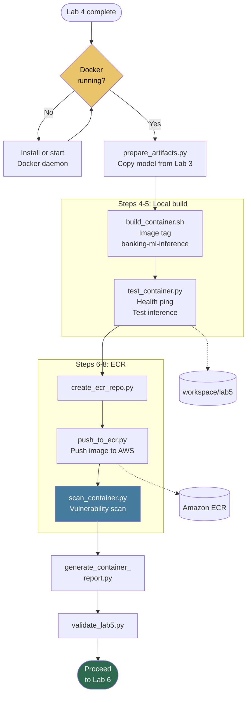

# Lab 5: Secure Containerization for Banking

**Class:** `ai-mlops-2026-jun30` · **Module 6:** Model Packaging and Containerization · **Duration:** ~30 min

Hands-on steps: [STEPS.md](STEPS.md)

---

## Terms & acronyms (beginners)

| Term | Full form / meaning |
|------|---------------------|
| **Docker** | Platform to build **containers** — packaged apps with dependencies included |
| **Container** | Lightweight, portable **image** that runs the same on EC2, SageMaker, etc. |
| **ECR** | **Elastic Container Registry** — AWS storage for Docker images |
| **EC2** | **Elastic Compute Cloud** — virtual server where you build and test the image |
| **KMS** | **Key Management Service** — encrypts images in ECR |
| **Inference** | Using a trained model to **score new transactions** (predict risk) |
| **HTTP** | **Hypertext Transfer Protocol** — web protocol (`GET /ping`, `POST /invocations`) |
| **Vulnerability scan** | Automated check for **known security issues** in container images |

---

## Overview

Lab 5 packages the Lab 3 **best model** into a **Docker inference container**, tests it locally on EC2, pushes to **Amazon ECR** with KMS encryption, and runs an **image vulnerability scan** for banking compliance.

Requires Docker (installed in Lab 0 Step 17).

---

## Prerequisites

- Lab 4 complete — `validate_lab4.py` passed
- Docker running: `docker ps` succeeds
- `workspace/lab3/models/best_model.pkl`

---

## Lab flowchart

## Lab flow

| Step | Script | Purpose |
|------|--------|---------|
| 3 | `prepare_artifacts.py` | Copy model, preprocessor, feature metadata from Lab 3 |
| 4 | `build_container.sh` | Build `banking-ml-inference:latest` |
| 5 | `test_container.py` | Health check + sample inference on EC2 |
| 6 | `create_ecr_repo.py` | Create ECR repo `banking-ml-inference` with scan-on-push |
| 7 | `push_to_ecr.py` | Tag and push image to ECR (boto3) |
| 8 | `scan_container.py` | Read ECR scan findings |
| 9 | `generate_container_report.py` | Container compliance report |
| 10 | `validate_lab5.py` | Gate to Lab 6 |

**Quick run:** `python3 scripts/run_lab5.py` then `validate_lab5.py`.

---

## Application code

### `src/serve.py`

Flask-based inference server for SageMaker-compatible hosting:

- `GET /ping` — health check (returns 200)
- `POST /invocations` — JSON payload in, risk score out

Loads `best_model.pkl` and `preprocessor.pkl` at startup.

### `Dockerfile`

Multi-stage-friendly image definition:

- Base Python image with pinned sklearn version (~1.6)
- Copies model artifacts and `serve.py`
- Exposes port 8080 for SageMaker inference

---

## Scripts reference

### `prepare_artifacts.py`

Copies `best_model.pkl`, `preprocessor.pkl`, and `feature_metadata.json` into `workspace/lab5/models/` and `config/`.

### `build_container.sh`

Runs `docker build` from `lab5/` context. Tags image `banking-ml-inference:latest`.

### `test_container.py`

Starts container locally, sends test transaction JSON, validates response schema. Writes `validation/container_test.json`.

### `create_ecr_repo.py`

Creates ECR repository with KMS encryption and image scanning enabled. Saves URI to `ecr_config.json`.

### `push_to_ecr.py`

Authenticates to ECR via boto3, tags image with account/registry URI, pushes layers. No AWS CLI required.

### `scan_container.py`

Polls ECR `describe_image_scan_findings` after push. Summarizes CRITICAL/HIGH counts to `scan_report.json`.

### `generate_container_report.py`

Combines scan results, test results, and ECR metadata into `container_compliance_report.json` and deployment manifest.

### `validate_lab5.py`

Verifies ECR config, scan report, and container test passed.

### `lab_paths.py`

Paths under `workspace/lab5/`.

---

## Configuration & outputs

**Workspace (`workspace/lab5/`):**

| Path | Purpose |
|------|---------|
| `models/best_model.pkl`, `preprocessor.pkl` | Inference artifacts |
| `config/ecr_config.json` | Repository URI and ARN |
| `config/scan_report.json` | Vulnerability summary |
| `config/container_compliance_report.json` | Compliance sign-off |
| `validation/container_test.json` | Local inference test |

**AWS:** ECR repository `banking-ml-inference` with pushed image.

---

## Next lab

[Lab 6: Blue-Green Deployment](../lab6/README.md)
