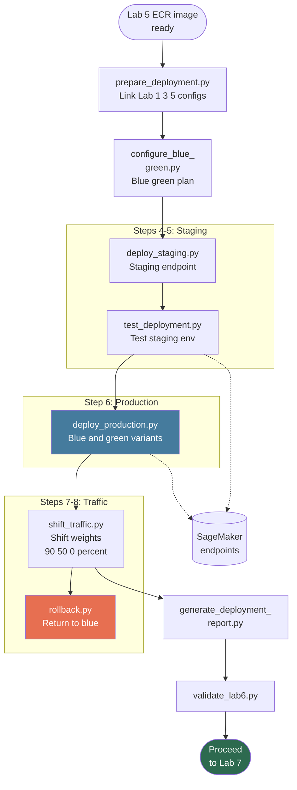

# Lab 6: Model Deployment with Blue-Green

**Class:** `ai-mlops-2026-jun30` · **Module 7:** Model Deployment on AWS · **Duration:** ~30–45 min

Hands-on steps: [STEPS.md](STEPS.md)

---

## Terms & acronyms (beginners)

| Term | Full form / meaning |
|------|---------------------|
| **SageMaker** | AWS **managed machine learning** service for hosting models |
| **Endpoint** | A **live URL/API** that serves predictions from your model 24/7 |
| **ECR** | **Elastic Container Registry** — where the Lab 5 Docker image is stored |
| **IAM** | **Identity and Access Management** — SageMaker needs roles via **PassRole** permission |
| **ARN** | **Amazon Resource Name** — unique ID for endpoints, models, and roles |
| **Blue-green deployment** | Run **two versions** (blue = current, green = new) and shift traffic safely |
| **Staging** | **Pre-production** environment for testing before live traffic |
| **Rollback** | **Revert** traffic to the previous safe version if something goes wrong |
| **Variant** | A **version** of the model on one endpoint (e.g. blue 100%, green 0%) |
| **API** | **Application Programming Interface** — `invoke_endpoint` sends JSON for scoring |

---

## Overview

Lab 6 deploys the Lab 5 container image to **real SageMaker endpoints** using a **blue-green** strategy: staging endpoint first, production with two variants (blue/green), gradual traffic shift, and a rollback drill.

All deployment scripts use live AWS APIs — no simulation.

---

## Prerequisites

- Lab 5 complete — ECR image `banking-ml-inference` pushed
- `workspace/lab5/config/ecr_config.json`
- Lab 1 IAM roles (ML Engineer PassRole permissions)

---

## Lab flowchart

## Lab flow

| Step | Script | Purpose |
|------|--------|---------|
| 2 | `prepare_deployment.py` | Links Labs 1, 3, 5 configs into deployment state |
| 3 | `configure_blue_green.py` | Blue-green plan JSON (variant names, initial weights) |
| 4 | `deploy_staging.py` | SageMaker endpoint `banking-endpoint-staging-*` |
| 5 | `test_deployment.py` | Invoke endpoint with sample payloads |
| 6 | `deploy_production.py` | Production endpoint with blue (v1) and green (v2) variants |
| 7 | `shift_traffic.py` | Update variant weights: 90% green → 50% → 0% blue |
| 8 | `rollback.py` | Emergency rollback to 100% blue |
| 9 | `generate_deployment_report.py` | Deployment compliance report from AWS describe calls |
| 10 | `validate_lab6.py` | Gate to Lab 7 |

**Quick run:** `python3 scripts/run_lab6.py`

---

## Scripts reference

### `sm_deploy.py`

Shared SageMaker helper module used by deploy, test, shift, and rollback scripts:

- Creates SageMaker models from ECR image URI
- Creates endpoint configurations with KMS encryption
- Creates/updates endpoints and variant weights
- Handles `iam:PassRole` to `BankingMLEngineerRole`

### `prepare_deployment.py`

Reads `ecr_config.json`, `best_model.pkl` metadata, and S3 bucket names. Writes `deployment_state.json` and `environments/prod.json`.

### `configure_blue_green.py`

Defines blue (current production) and green (candidate) variant names, instance types, and initial traffic split (100% blue).

### `deploy_staging.py`

Single-variant staging endpoint for pre-production testing. Saves endpoint name to `staging_deployment.json`.

### `test_deployment.py`

Invokes SageMaker Runtime `invoke_endpoint` with JSON test records. Validates HTTP 200 and response shape. `--environment staging|production`.

### `deploy_production.py`

Creates production endpoint with two production variants for blue-green cutover.

### `shift_traffic.py`

Calls `update_endpoint_weights_and_capacities` with stepped traffic migration (`--steps 90,50,0`).

### `rollback.py`

Sets blue variant to 100% traffic; logs action to `rollback_log.json`.

### `generate_deployment_report.py`

Describes live endpoints and captures deployment compliance status.

### `validate_lab6.py`

Requires `staging_deployment.json` and `production_deployment.json` with valid endpoint names.

### `lab_paths.py`

Paths under `workspace/lab6/`.

---

## Configuration & outputs

**Workspace (`workspace/lab6/config/`):**

| File | Purpose |
|------|---------|
| `deployment_state.json` | Resolved ARNs and image URI |
| `blue_green_plan.json` | Variant strategy |
| `staging_deployment.json` | Staging endpoint name |
| `production_deployment.json` | Production endpoint + variants |
| `traffic_shift.json` | Traffic shift history |
| `rollback_log.json` | Rollback drill record |
| `deployment_report.json` | Compliance summary |

**AWS:** SageMaker endpoints `banking-endpoint-staging-*`, `banking-endpoint-prod-*`.

---

## Troubleshooting

**`ResourceLimitExceeded` on production deploy (Step 6):** Staging uses 1 × `ml.m5.large`; blue-green production uses 2 more. If the account quota is full (often 4 instances), delete unused endpoints or ask the instructor for a quota increase. Full copy-paste steps: [STEPS.md — Troubleshooting](STEPS.md#copy-paste--resourcelimitexceeded-on-step-6).

---

## Architecture role

Lab 6 is the **deployment layer** (Lab 10). Evidence: `staging_deployment.json`, `production_deployment.json`.

---

## Next lab

[Lab 7: Compliance Monitoring & Observability](../lab7/README.md)
