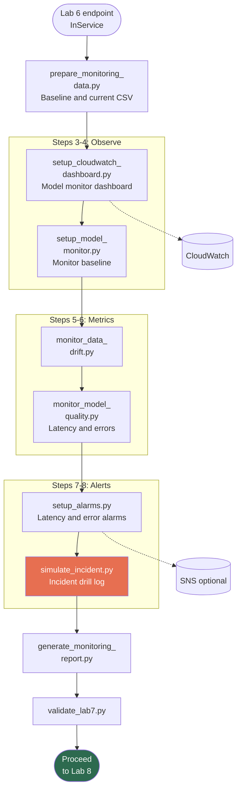

# Lab 7: Compliance Monitoring & Observability

**Class:** `ai-mlops-2026-jun30` · **Module 8:** Monitoring and Observability · **Duration:** ~30 min

Hands-on steps: [STEPS.md](STEPS.md)

---

## Terms & acronyms (beginners)

| Term | Full form / meaning |
|------|---------------------|
| **Observability** | Ability to **see** how a live system behaves (metrics, logs, alerts) |
| **CloudWatch** | AWS **monitoring** service — dashboards, metrics, and alarms |
| **SageMaker** | AWS ML platform; here you monitor the **production endpoint** |
| **Model Monitor** | SageMaker tooling to track **data quality** and drift on live traffic |
| **Drift** | When **input data** or predictions change vs. the training baseline |
| **Alarm** | CloudWatch rule that **notifies** you when a metric crosses a threshold |
| **Latency** | **Response time** for each prediction (milliseconds) |
| **Incident response** | **Runbook** steps when an alert fires (simulated in this lab) |
| **Dashboard** | Visual **summary** of key metrics in the AWS console |

---

## Overview

Lab 7 adds **operational observability** for deployed banking models: CloudWatch dashboards, data drift checks, model quality metrics, alarms, and an incident response drill. Monitoring targets the **production SageMaker endpoint** from Lab 6.

---

## Prerequisites

- Lab 6 complete — production endpoint `InService`
- `workspace/lab6/config/production_deployment.json`

---

## Lab flowchart

## Lab flow

| Step | Script | Purpose |
|------|--------|---------|
| 2 | `prepare_monitoring_data.py` | Baseline vs current sample CSVs from Lab 2 data |
| 3 | `setup_cloudwatch_dashboard.py` | Dashboard `Banking-MLOps-Model-Monitor` with endpoint metrics |
| 4 | `setup_model_monitor.py` | Model Monitor baseline config linked to endpoint |
| 5 | `monitor_data_drift.py` | Statistical drift between baseline and current |
| 6 | `monitor_model_quality.py` | Latency and error metrics from CloudWatch |
| 7 | `setup_alarms.py` | Alarms for high latency and error rate |
| 8 | `simulate_incident.py` | Tabletop incident drill; writes `incident_drill.json` |
| 9 | `generate_monitoring_report.py` | Consolidated monitoring compliance report |
| 10 | `validate_lab7.py` | Gate to Lab 8 |

**Quick run:** `python3 scripts/run_lab7.py`

---

## Scripts reference

### `monitoring_helpers.py`

Resolves the active production endpoint name from Lab 6 configs. Shared by dashboard, drift, quality, and alarm scripts.

### `prepare_monitoring_data.py`

Copies Lab 2 engineered data slices into `data/baseline_data.csv` and `data/current_data.csv`. Writes `monitoring_state.json` with endpoint ARN.

### `setup_cloudwatch_dashboard.py`

Creates a CloudWatch dashboard with SageMaker endpoint metrics (Invocations, ModelLatency, OverheadLatency, Errors). Uses **full metric definitions** (CloudWatch rejects multiple `...` shorthand in one row).

### `setup_model_monitor.py`

Records Model Monitor configuration: baseline S3 URI, schedule, and endpoint association in `model_monitor.json`.

### `monitor_data_drift.py`

Compares feature distributions (PSI-style checks). Outputs `drift_monitor_report.json` with drift severity.

### `monitor_model_quality.py`

Queries CloudWatch `GetMetricStatistics` for endpoint latency and 4xx/5xx rates over a recent window.

### `setup_alarms.py`

Creates `banking-ml-high-latency` and `banking-ml-error-rate` CloudWatch alarms. Saves ARNs to `alarms.json`.

### `simulate_incident.py`

Simulates drift alert → runbook steps → resolution notes for compliance audit trail.

### `generate_monitoring_report.py`

Merges dashboard, drift, quality, and alarm status into `results/monitoring_report_final.json`.

### `validate_lab7.py`

Checks dashboard config, alarms, and monitoring report exist.

### `lab_paths.py`

Paths under `workspace/lab7/`.

---

## Configuration & outputs

**Workspace (`workspace/lab7/`):**

| Path | Purpose |
|------|---------|
| `data/baseline_data.csv`, `current_data.csv` | Drift comparison inputs |
| `config/dashboard_config.json` | CloudWatch dashboard name/ARN |
| `config/model_monitor.json` | Model Monitor setup |
| `config/drift_monitor_report.json` | Drift findings |
| `config/quality_report.json` | Latency/error summary |
| `config/alarms.json` | Alarm definitions |
| `results/monitoring_report_final.json` | Compliance report |
| `logs/incident_drill.json` | Incident simulation log |

**AWS:** CloudWatch dashboard and alarms on production endpoint.

---

## Architecture role

Lab 7 is the **monitoring layer** (Lab 10). Evidence: `dashboard_config.json`, `alarms.json`.

---

## Next lab

[Lab 8: End-to-End SageMaker Pipeline](../lab8/README.md)
