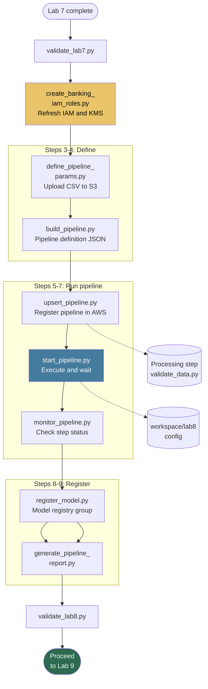

# Lab 8: End-to-End SageMaker Pipeline

**Class:** `ai-mlops-2026-jun30` · **Module 9:** SageMaker Pipelines · **Duration:** ~30 min

Hands-on steps: [STEPS.md](STEPS.md)

---

## Terms & acronyms (beginners)

| Term | Full form / meaning |
|------|---------------------|
| **SageMaker Pipeline** | AWS workflow that **chains** ML steps (validate → process → register) |
| **ProcessingStep** | Pipeline step that runs a **Python script** on managed compute |
| **Model Registry** | SageMaker **catalog** of approved model versions for production |
| **Upsert** | **Create or update** the pipeline definition in AWS |
| **S3** | **Simple Storage Service** — pipeline input data and script uploads |
| **IAM** | **Identity and Access Management** — pipeline needs **PassRole** to SageMaker |
| **KMS** | **Key Management Service** — encryption for S3 and SageMaker |
| **ARN** | **Amazon Resource Name** — pipeline, execution, and model package IDs |
| **ECR** | **Elastic Container Registry** — container image linked at model registration |

---

## Overview

Lab 8 automates the ML workflow with a **real SageMaker Pipeline** (`banking-ml-pipeline`): data validation, processing, model registration in the **SageMaker Model Registry**, and compliance reporting. This connects data (Lab 2), containers (Lab 5), and deployment context (Lab 6) into a reproducible pipeline.

**Before starting:** run `lab1/scripts/create_banking_iam_roles.py` to refresh IAM permissions (PassRole, KMS, pipeline S3, AddTags).

---

## Prerequisites

- Lab 7 complete — `validate_lab7.py` passed
- Lab 5 ECR image in `banking-ml-inference`
- Lab 2 engineered data available

---

## Lab flowchart

## Lab flow

| Step | Script | Purpose |
|------|--------|---------|
| 3 | `define_pipeline_params.py` | Pipeline parameters; copy CSV to S3; `pipeline_params.json` |
| 4 | `build_pipeline.py` | Build pipeline definition JSON |
| 5 | `upsert_pipeline.py` | Create/update pipeline in SageMaker with ProcessingStep |
| 6 | `start_pipeline.py` | Start execution; wait for completion |
| 7 | `monitor_pipeline.py` | Poll step status; save execution ARN |
| 8 | `register_model.py` | Register model package in `banking-risk-models` group |
| 9 | `generate_pipeline_report.py` | Pipeline compliance report |
| 10 | `validate_lab8.py` | Gate to Lab 9 |

**Quick run:** `python3 scripts/run_lab8.py` (includes IAM refresh at start).

---

## Pipeline code (`pipeline/`)

### `pipeline/validate_data.py`

SageMaker **ProcessingStep** entrypoint script. Uploaded to S3 by `upsert_pipeline.py` and run inside a processing container. Validates that the input banking CSV has at least 10 rows — a lightweight data-quality gate before model steps.

### `pipeline/pipeline_definition.json`

Local stub of step definitions; overwritten when `build_pipeline.py` and `upsert_pipeline.py` run.

---

## Scripts reference

### `define_pipeline_params.py`

Defines SageMaker pipeline parameters (instance types, S3 paths, model approval status). Copies `engineered_banking_data.csv` from Lab 2 workspace to the processed S3 bucket.

### `build_pipeline.py`

Constructs the pipeline graph JSON (ProcessingStep for data validation). Writes `workspace/lab8/config/pipeline_definition.json`.

### `upsert_pipeline.py`

Uses SageMaker Python SDK to build and **upsert** the pipeline in AWS. Uploads `validate_data.py` as processing script. Saves pipeline ARN to `pipeline_registration.json`.

### `start_pipeline.py`

Calls `pipeline.start()` and waits for terminal state. On failure, prints step failure reason. Writes `pipeline_execution.json`.

### `monitor_pipeline.py`

Describes execution steps and statuses from SageMaker API. Updates `pipeline_monitor.json`.

### `register_model.py`

Creates a model package in the Model Registry group `banking-risk-models`, linking ECR image from Lab 5 and model artifacts. Requires `lab_paths.LAB5` for ECR config.

### `generate_pipeline_report.py`

Summarizes pipeline registration, execution, and registry state for auditors.

### `validate_lab8.py`

Checks `pipeline_params.json`, `pipeline_registration.json`, `pipeline_execution.json`, `pipeline_monitor.json`, and `model_registry.json`.

### `lab_paths.py`

Paths for Lab 8 workspace plus references to Lab 2 (`LAB2`), Lab 5 (`LAB5`), and Lab 6 (`LAB6`) workspaces.

### `run_lab8.py`

Orchestrates full workflow with `refresh_banking_iam()` from `scripts/course_common.py`.

---

## Configuration & outputs

**Workspace (`workspace/lab8/`):**

| Path | Purpose |
|------|---------|
| `config/pipeline_params.json` | Parameter values and S3 URIs |
| `config/pipeline_definition.json` | Pipeline graph |
| `config/pipeline_registration.json` | Pipeline name/ARN in SageMaker |
| `config/pipeline_execution.json` | Execution ID and status |
| `config/pipeline_monitor.json` | Per-step status |
| `config/model_registry.json` | Model package ARN |
| `data/banking_data.csv` | Local copy of pipeline input |
| `results/pipeline_compliance_report_final.json` | Compliance summary |

**AWS:** Pipeline `banking-ml-pipeline`, Model Registry group `banking-risk-models`.

---

## Architecture role

Lab 8 is the **pipeline layer** (Lab 10). Evidence: `pipeline_registration.json`, `model_registry.json`, `pipeline_execution.json`.

---

## Next lab

[Lab 9: Banking Security & Governance Framework](../lab9/README.md)
