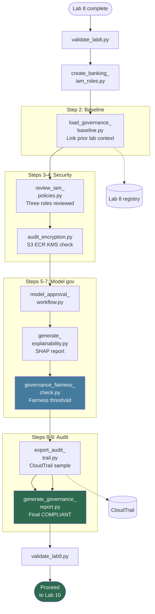

# Lab 9: Banking Security & Governance Framework

**Class:** `ai-mlops-2026-jun30` · **Module 10:** Security, Governance, and Responsible AI · **Duration:** ~30 min

Hands-on steps: [STEPS.md](STEPS.md)

---

## Terms & acronyms (beginners)

| Term | Full form / meaning |
|------|---------------------|
| **Governance** | **Policies and controls** so ML is secure, fair, and auditable |
| **IAM** | **Identity and Access Management** — review who can do what in AWS |
| **KMS** | **Key Management Service** — encryption keys for S3, ECR, SageMaker |
| **S3** | **Simple Storage Service** |
| **ECR** | **Elastic Container Registry** — container images audited for encryption |
| **SHAP** | **SHapley Additive exPlanations** — method to explain **which features** drive predictions |
| **CloudTrail** | AWS **audit log** of API activity (who changed what, when) |
| **Explainability** | Making model decisions **understandable** to humans and regulators |
| **Fairness** | Checking outcomes across groups (e.g. **disparate impact** ratio) |
| **Approval workflow** | Formal steps before a model moves to **production** |

---

## Overview

Lab 9 implements the **governance layer**: IAM policy review, encryption audit, model approval workflow, explainability (SHAP), fairness governance, CloudTrail audit export, and a final governance compliance report. It ties together security from Lab 1, the model registry from Lab 8, and fairness from Lab 3.

**Before starting:** run `lab1/scripts/create_banking_iam_roles.py` for latest IAM/KMS permissions.

---

## Prerequisites

- Lab 8 complete — `validate_lab8.py` passed
- `workspace/lab8/config/model_registry.json`
- Lab 3 test data and Lab 5 model for explainability

---

## Lab flowchart

## Lab flow

| Step | Script | Purpose |
|------|--------|---------|
| 2 | `load_governance_baseline.py` | Link Lab 1 IAM, Lab 8 registry, Lab 1 CloudTrail context |
| 3 | `review_iam_policies.py` | Live IAM review of three banking roles |
| 4 | `audit_encryption.py` | Verify S3, ECR, SageMaker use KMS |
| 5 | `model_approval_workflow.py` | Approval state: fairness + security scan → pending compliance |
| 6 | `generate_explainability.py` | SHAP feature importance report |
| 7 | `governance_fairness_check.py` | Disparate impact vs 0.80 threshold |
| 8 | `export_audit_trail.py` | Sample CloudTrail events to JSON |
| 9 | `generate_governance_report.py` | Overall COMPLIANT status |
| 10 | `validate_lab9.py` | Gate to Lab 10 |

**Quick run:** `python3 scripts/run_lab9.py`

---

## Scripts reference

### `load_governance_baseline.py`

Copies model and test data from prior labs. Loads `model_registry.json` from Lab 8. Links CloudTrail trail name from Lab 1 workspace. Writes `governance_state.json`.

### `review_iam_policies.py`

Calls `iam:GetRole` and `iam:GetRolePolicy` for Data Scientist, ML Engineer, and Compliance Officer roles. Flags over-privileged actions. Output must include `"source": "aws-iam"`.

### `audit_encryption.py`

Checks S3 bucket default encryption, ECR repository encryption, and KMS key usage. Output must include `"source": "aws"`.

### `model_approval_workflow.py`

Simulates a three-party approval: data science (fairness), security (container scan), compliance officer (pending). Writes `approval_workflow.json`.

### `generate_explainability.py`

Uses SHAP on a sample of `X_test.csv` with `best_model.pkl`. Ranks top features (e.g. `transaction_amount`, `merchant_category`). Saves `explainability_report.json`.

### `governance_fairness_check.py`

Recomputes disparate impact on holdout data. Compares to 0.80 regulatory-style threshold. Status `APPROVED` or `REVIEW`.

### `export_audit_trail.py`

Queries CloudTrail `lookup_events` for SageMaker and IAM API calls. Samples recent events into `governance_audit_export.json` (`source: cloudtrail`).

### `generate_governance_report.py`

Aggregates IAM, encryption, fairness, and approval state into `governance_report_final.json` with overall `COMPLIANT` status.

### `validate_lab9.py`

Requires `governance_report_final.json`, `governance_state.json`, `iam_review.json`, `encryption_audit.json`, and `governance_audit_export.json`.

### `lab_paths.py`

Paths under `workspace/lab9/`; references to Lab 3 (`LAB3`) and Lab 5 (`LAB5`).

### `run_lab9.py`

Runs all governance steps except validation.

---

## Configuration & outputs

**Workspace (`workspace/lab9/`):**

| Path | Purpose |
|------|---------|
| `config/governance_state.json` | Baseline links to prior labs |
| `config/iam_review.json` | IAM compliance review |
| `config/encryption_audit.json` | Encryption posture |
| `config/approval_workflow.json` | Model approval state |
| `data/X_test.csv` | Explainability/fairness input |
| `models/best_model.pkl` | Model for SHAP |
| `results/explainability_report.json` | SHAP rankings |
| `results/governance_fairness.json` | Fairness governance |
| `results/governance_report_final.json` | Final compliance report |
| `logs/governance_audit_export.json` | CloudTrail sample |

---

## Architecture role

Lab 9 is the **governance layer** (Lab 10). Evidence: `iam_review.json`, `encryption_audit.json`.

---

## Next lab

[Lab 10: Enterprise MLOps Architecture](../lab10/README.md)
