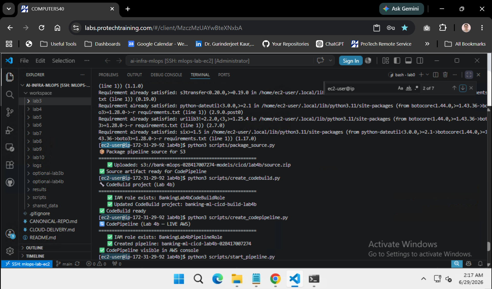
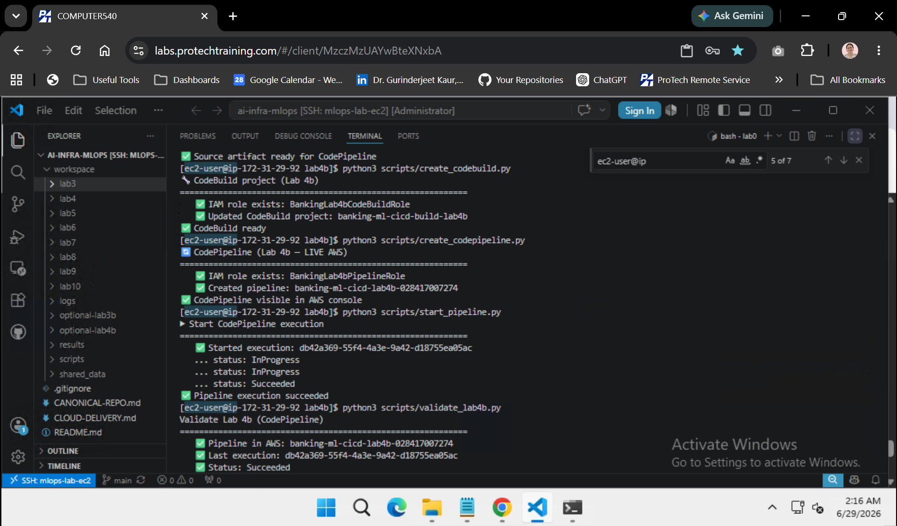

# Lab 4b optional — Real CodePipeline (post-course)

| | |
|---|---|
| **Duration** | ~45–60 minutes |
| **Region** | `us-west-2` |
| **Platform** | EC2 · VS Code Remote SSH · bash |
| **Prerequisite** | [Lab 4](../../lab4/STEPS.md) complete · IAM permission to create CodePipeline/CodeBuild |
| **Working directory** | `~/ai-infra-mlops/optional/lab4b` |
| **Outputs** | `~/ai-infra-mlops/workspace/optional-lab4b/` |
| **Cost** | CodePipeline + CodeBuild per execution (small) |

> **Optional post-course module.** Main Lab 4 only writes JSON locally; this lab creates a **real** S3 → CodeBuild pipeline in AWS.  
> **Run every command on EC2** (`whoami` = `ec2-user`) — not on the ProTech Windows VM.

---

## Before you start

```bash
cd ~/ai-infra-mlops && git pull
cd ~/ai-infra-mlops/lab4 && python3 scripts/validate_lab4.py
cd ~/ai-infra-mlops/optional/lab4b
python3 -m pip install -r requirements.txt
```

**Expected:** Lab 4 validation passes.

> Your EC2 user/role needs: `codepipeline:*`, `codebuild:*`, `iam:CreateRole`, `iam:PassRole`, `s3:*` on banking buckets. Instructor accounts usually have this; student roles may not.


---

## Lab 4b roadmap

| Step | What happens on AWS |
|------|---------------------|
| **1** | Upload source zip to S3 |
| **2** | Create CodeBuild project + IAM role |
| **3** | Create CodePipeline (Source → Build) |
| **4** | Start execution and wait for **Succeeded** |
| **5** | Validate + optional teardown |

---

# Step 1 — Package and upload source

```bash
python3 scripts/package_source.py
```

**Expected:**

```text
📦 Package pipeline source for S3
============================================================
   ✅ Uploaded: s3://bank-mlops-<account-id>-models/cicd/lab4b/source.zip
✅ Source artifact ready for CodePipeline
```

---

# Step 2 — Create CodeBuild project

```bash
python3 scripts/create_codebuild.py
```

**Expected:**

```text
🔧 CodeBuild project (Lab 4b)
============================================================
   ✅ Created IAM role: BankingLab4bCodeBuildRole
   ✅ Created CodeBuild project: banking-ml-cicd-build-lab4b
✅ CodeBuild ready
```

On re-run: `exists` / `Updated` messages are OK.

---

# Step 3 — Create CodePipeline

```bash
python3 scripts/create_codepipeline.py
```

**Expected:**

```text
🔄 CodePipeline (Lab 4b — LIVE AWS)
============================================================
   ✅ Created IAM role: BankingLab4bPipelineRole
   ✅ Created pipeline: banking-ml-cicd-lab4b-<account-id>
✅ CodePipeline visible in AWS console
```

**Console:** [CodePipeline](https://us-west-2.console.aws.amazon.com/codesuite/codepipeline/pipelines) — you should see your pipeline (main Lab 4 had **zero** pipelines).



---

# Step 4 — Run the pipeline

```bash
python3 scripts/start_pipeline.py
```

**Expected:**

```text
▶ Start CodePipeline execution
============================================================
   ✅ Started execution: <uuid>
   ... status: InProgress
   ... status: Succeeded
✅ Pipeline execution succeeded
```

First run may take **5–10 minutes** (CodeBuild provisioning + build).

If you previously hit Source-stage permission errors, run the patch once before Step 4:

```bash
python3 scripts/patch_iam_for_lab4b.py
# wait ~30 seconds
python3 scripts/start_pipeline.py
```



---

# Step 5 — Validate Lab 4b

```bash
python3 scripts/validate_lab4b.py
```

**Expected:**

```text
Validate Lab 4b (CodePipeline)
============================================================
   ✅ Pipeline in AWS: banking-ml-cicd-lab4b-<account-id>
   ✅ Last execution: <uuid>
   ✅ Status: Succeeded

============================================================
Lab 4b OK — real CodePipeline ran in AWS
```


---

# Step 6 — Teardown (optional, recommended)

```bash
python3 scripts/teardown_lab4b.py
```

Deletes pipeline, CodeBuild project, and Lab 4b IAM roles. S3 zip/artifacts may remain.

---

## Troubleshooting

| Issue | Fix |
|-------|-----|
| `AccessDenied` on `create_pipeline` | Need instructor/IAM admin permissions |
| Source stage **Failed** — *role does not have permissions* | Run `python3 scripts/patch_iam_for_lab4b.py`, wait 30s, re-run Steps 3–4 (`git pull` includes KMS + `s3:GetBucketVersioning` fix) |
| `PipelineExecutionNotFoundException` in Step 4 | `git pull` for latest `start_pipeline.py` retry logic |
| Build stage **Failed** | CodeBuild → build → logs; wait 30s and re-run Step 4 |
| `PipelineNameInUseException` handled | Re-run updates existing pipeline |
| Source action fails | Re-run Step 1 to refresh `source.zip` in S3 |

---

## Compare with main Lab 4

| | Lab 4 (main) | Lab 4b (this module) |
|---|--------------|----------------------|
| CodePipeline in console | **No** | **Yes** |
| CodeBuild | No | Yes — runs `compliance_check.py` |
| Compliance gates | Local file checks | Build step in pipeline |
| Account ID | Real (STS) | Real (STS) |

---

## Previous → [Lab 3b — SageMaker Training](../lab3b/STEPS.md) · Next → [Lab 5](../../lab5/STEPS.md)
